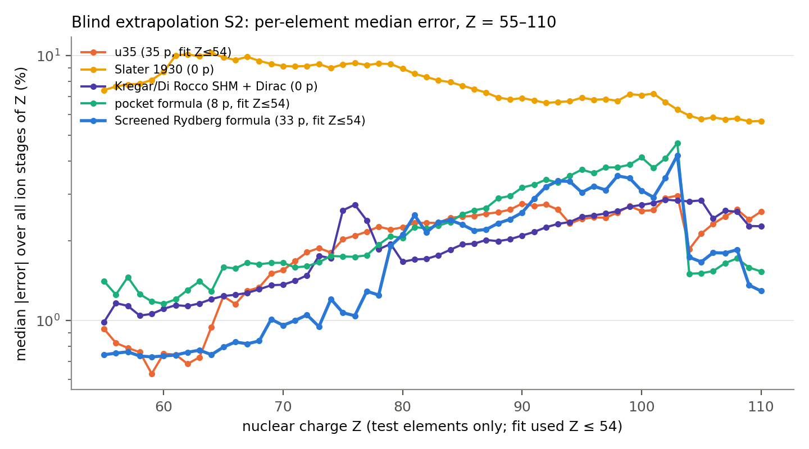
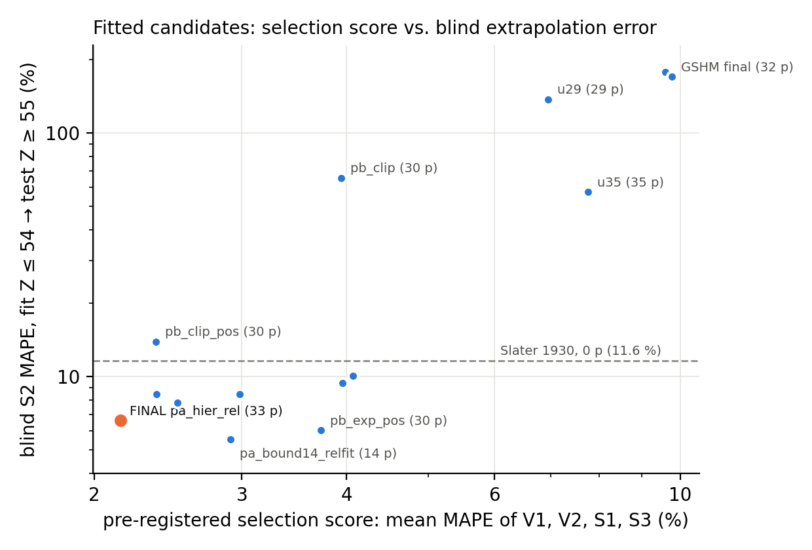
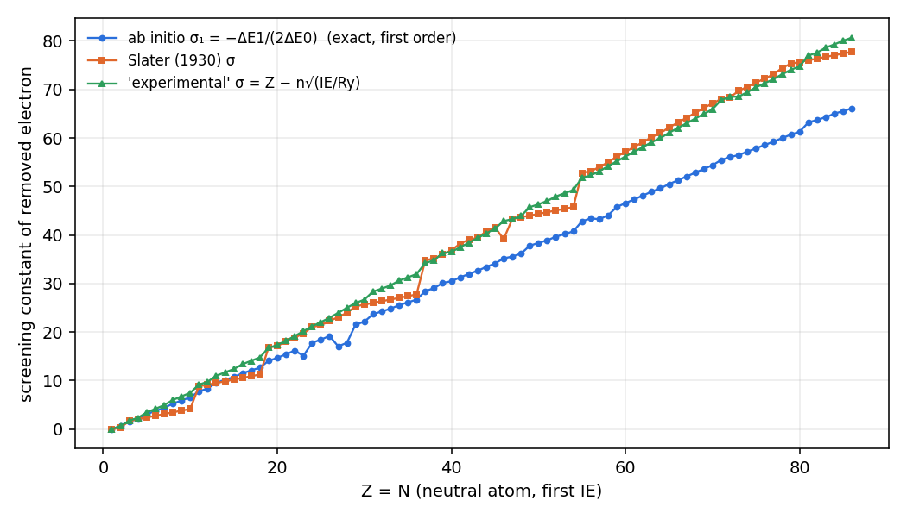

# A screened Rydberg formula for the successive ionization energies of all atoms and ions

**Muhammad Awais**

Independent researcher. Correspondence: mawais9171@gmail.com

---

**Abstract—**We present a single closed-form expression, the *screened Rydberg formula*, for the successive ionization energy
IE(Z, N) of any atom or ion. It needs only the nuclear charge Z and the ground electron configuration. The formula
keeps the hydrogenic form Ry Z_eff²/n². Its effective charge is split into two parts. The first is an exact,
parameter-free first-order screening constant σ₁ = −n²ΔE₁ from the 1/Z perturbation expansion; it is a rational
number for every configuration, and we tabulate it for N = 1–110. The second is a bounded, fitted higher-order
remainder that depends on the ion charge in an Edlén-type form. A saturation construction guarantees
Z − N + 1 ≤ Z_eff ≤ Z for any parameter values (given 0 ≤ σ₁ ≤ N − 1, which holds for every configuration we
use) and keeps the exact Z² and Z coefficients of the 1/Z series. One-electron
Dirac, recoil, finite-nuclear-size and QED corrections are added without fitted parameters. The final model has 33
fitted global parameters and no per-element or per-ion parameters. On all 5847 successive ionization energies in the
NIST Atomic Spectra Database (Z = 1–110), its mean absolute percentage error (MAPE) is 1.87 % (median 0.94 %). That is
7.52 % for neutral-atom first ionization energies and 0.0012 % for hydrogen-like ions; the H-like figure is consistent
with, but not independent of, the QED theory behind the NIST values. The model was chosen by a pre-registered score
that never used the blind extrapolation test (its interpolation splits do contain heavy elements). In a single blind
extrapolation (fit Z ≤ 54, predict Z = 55–110), it gives 6.60 % MAPE
(median 1.62 %). The same test gives 11.6 % for Slater's rules, 13.6 % for a published parameter-free
screened-hydrogenic model scored on the same rows, and 57.2 % and 170 % for two earlier fitted variants without the bound (Table 1).
Extrapolation to heavy neutral atoms remains the weak point (21.8 % MAPE on their first ionization energies). In the
blind fit Pb and Tl come out at about 1.2 and 1.7 eV, against 7.42 and 6.11 eV, and Lr comes out negative. With all
data fitted, the formula still places oganesson (3.66 eV) far below radon (NIST 10.75 eV). All of these failures are
reported, not corrected.

**Index Terms—** ionization energy; screening constants; 1/Z expansion; screened hydrogenic model; isoelectronic
sequences; Slater's rules; blind validation.

---

## 1. Introduction

The Bohr energy Ry Z²/n² is exact only for a non-relativistic one-electron ion. For every other atom and ion the
ionization energy (IE) is controlled by electron–electron repulsion, which has no closed-form solution for N ≥ 2. Two
broad routes exist.

**Screening rules.** Slater [1] replaced Z by an effective charge Z − σ, with σ given by simple counting
rules fitted by hand to atomic data. Clementi and Raimondi [2], [3]
obtained σ from optimised self-consistent-field orbital exponents of neutral atoms. Both are designed for orbitals of
neutral atoms, not for the full set of successive IEs. Scored as IE formulas on all NIST ions with a total-energy
difference, Slater's rules give 11.8 % MAPE and Clementi–Raimondi 120 % (§4).

**Perturbation theory in 1/Z.** Layzer [4], [5] showed that the non-relativistic
energy of a fixed configuration is an asymptotic series E = Z²E₀ + ZE₁ + E₂ + …. E₀ is hydrogenic and E₁ is a
rational combination of hydrogenic Slater integrals, which fixes the exact Z → ∞ limit of the screening constant.
Higher orders need continuum sums [6], [7]. Along isoelectronic sequences, Edlén
[8] systematised the smooth variation of screening with ion charge, using expansions in 1/(ζ + s). Z-expansion
codes with relativistic corrections were developed for selected sequences [9].

**Screened hydrogenic models (SHMs).** Starting with Mayer [10] and More [11], plasma-physics codes use
screened hydrogenic energies with tabulated or fitted screening constants: l-splitting [12], [13], analytical potentials [14], [15], relativistic constants fitted by genetic algorithm
[16], and a parameter-free, self-consistent (Z, N)-dependent screening [17]–[22]. Average-atom and kinetics codes value these for speed and
coverage of all ions [23]–[25].

**Ab initio methods.** Koopmans' theorem [26], ΔSCF Hartree–Fock and Kohn–Sham DFT [27], [28], correlated non-relativistic energies [29] and Dirac–Fock total energies for all
ground configurations up to Z = 118 [30] give more accurate numbers. They are numerical procedures, not
formulas.

**The gap.** We found no single closed-form expression that (i) covers every ion of every element from the
configuration alone, (ii) reproduces the exact large-Z behaviour of the 1/Z expansion, (iii) reports every fitted
parameter, and (iv) is validated on all NIST successive IEs with held-out tests fixed in advance, including a blind
extrapolation to heavier elements. The SHM papers we read report accuracy on their fitting data. [20], for
example, reports selected sequences. Scored on our rows (§4.5), Mendoza et al.'s constants give 2.82 % MAPE on
the 5011 rows they cover. This paper
tries to fill that gap. It does not claim a new law of atomic physics; §5.1 states what is rediscovered.

**Contributions.**
1. A table of the exact first-order screening constants σ₁ for every NIST ground configuration, N = 1–110, as a
   parameter-free, Z → ∞-exact counterpart to Slater's σ (§2.1, §4.6).
2. The screened Rydberg formula: σ₁ plus a bounded Edlén-type remainder with 33 global parameters (§2.2–2.4).
3. A validation protocol with a pre-registered selection score and a single blind extrapolation test, applied
   identically to the final model, its ancestors and published baselines (§3, §4).
4. A head-to-head against two published SHMs, re-implemented and scored with the same scorer (§4.5): the
   parameter-free Kregar/Di Rocco model on all 5847 rows, and the fitted constants of Mendoza et al. (2011) on the
   5011 rows they cover.

---

## 2. Theory

Atomic units are used in §2.1, with energies converted to eV via Ry = 13.6057 eV. Z is the nuclear charge, N the
number of electrons before ionization, and Z_a = Z − N + 1 the charge seen by the departing electron. (n, l) is the
removed subshell and k its occupancy.

### 2.1 Exact first-order screening from the 1/Z expansion

Scaling r → ρ/Z turns the non-relativistic Hamiltonian into H = Z²[H₀ + Z⁻¹V], with H₀ hydrogenic and
V = Σ 1/ρ_ij. Rayleigh–Schrödinger perturbation theory in 1/Z then gives, for a fixed configuration and term,
E(Z, N) = Z²E₀ + ZE₁ + E₂ + …, and the ionization energy is

$$\mathrm{IE}(Z,N)=Z^2\Delta E_0+Z\,\Delta E_1+\Delta E_2+\dots,\qquad \Delta E_k=E_k(N-1)-E_k(N).$$

- **Zeroth order.** ΔE₀ = 1/(2n²), which is exactly Bohr's formula.
- **First order.** E₁ = ⟨V⟩ over the Z = 1 hydrogenic state. Every hydrogenic radial integral F^k and G^k is an exact
  rational number, because each product P_a P_c is a polynomial times e^{−βr} with rational β. Examples:
  F⁰(1s,1s) = 5/8, F⁰(1s,2s) = 17/81, G⁰(1s,2s) = 16/729. We evaluate them in exact rational arithmetic and combine
  them with exact angular algebra.
- **Open shells.** For open subshells, E₁ is evaluated for the Hund ground term by projecting onto the
  highest-weight (S, L) subspace. Where hydrogenic degeneracy couples configurations (the Layzer complex, e.g.
  1s²2s² with 1s²2p²), V is diagonalised within the complex. For two or more open subshells, a high-spin coupled term
  is used; this is the one approximation in σ₁.

Completing the square in the first two terms defines the first-order screening constant

$$\mathrm{IE}\simeq \Delta E_0\,(Z-\sigma_1)^2,\qquad \sigma_1=-\frac{\Delta E_1}{2\Delta E_0}=-n^2\Delta E_1 .$$

σ₁ is Layzer's Z → ∞ screening constant. It has no adjustable parameter and depends only on the configuration, not on
Z. Two checks against known values:

- **He-like:** E₁(1s²) = 5/8, so σ₁(He) = 0.6250 (Slater: 0.30).
- **Li-like:** E₁(1s²2s) = 5965/5832 = 1.0228052 = 5/8 + 2·17/81 − 16/729, so ΔE₁ = −0.397805 and σ₁ = 1.5912.
- **Be-like:** the complex value E₁ = 1.5592742 agrees with Layzer's.

The exact series fails for near-neutral atoms (§4.6). The expansion parameter is effectively N/Z. For a neutral atom,
Z − σ is only 1–3, so a 10 % error in σ becomes a 100–1000 % error in IE. A closed form for the higher orders does
not exist: E₂ already requires sums over the hydrogenic continuum. For example, the completed-square guess
ΔE₂ = ΔE₁²/(4ΔE₀) is 24–26 % too large for He- and Li-like ions. This is why the remainder in §2.2 has to be fitted.

### 2.2 The screened Rydberg form with a bounded remainder

The final model ("pa_hier_rel") is

$$
\mathrm{IE}(Z,N)=\mu(Z)\Big\{\mathrm{Ry}\,\frac{Z_\mathrm{eff}^2}{n^2}\,F_{n,j}(Z_\mathrm{eff})\Big[1+r_c\,\frac{(Z\alpha)^2}{n}\Big(\frac{Z_\mathrm{eff}}{Z_a}-1\Big)\Big]+\mathrm{Ry}\,\frac{x_l\,K_l(k)}{n^2}\Big\}-\big[\Delta E_\mathrm{QED}+\Delta E_\mathrm{FNS}\big]_{Z,n}\Big(\frac{Z_\mathrm{eff}}{Z}\Big)^2 ,
$$

where the last term applies only to the removal of an ns electron with n ≤ 2, and

$$
Z_\mathrm{eff}=Z-\sigma_1(\mathcal C)-D,\qquad
D=\frac{T}{Z_a+\kappa+|T|/h},\qquad
h=\begin{cases}(N-1)-\sigma_1 & T\ge 0\\ \sigma_1 & T<0\end{cases},\qquad
T=\sum_{g}\tau_g\,\nu_g+\sum_{c}\delta\tau_c\,\nu_c .
$$

The terms are:

- **ν_g (five screening groups).** Let (n, l) be the removed subshell. Each of the other N − 1 electrons, in a
  subshell (n′, l′), is counted in exactly one group.
  - *same*: the k − 1 other electrons of (n, l).
  - *out*: outer electrons, n′ > n, or n′ = n with l′ > l.
  - All other electrons (n′ < n, or n′ = n with l′ < l) are inner.
    - For an s or p target, inner electrons form *in* if n′ ≥ n − 1 and *core* if n′ ≤ n − 2. *in* is the ns
      electrons of an np target plus the whole (n − 1) shell, including its d and f electrons.
    - For a d or f target, all inner electrons form *df*, from the same-n lower-l subshells down to 1s.

  Hence Σ_g ν_g = N − 1, and each group has a coefficient τ_g. Examples, as (ν_same, ν_in, ν_core, ν_df, ν_out):
  - O 2p⁴: (3, 4, 0, 0, 0);
  - Na 3s: (0, 8, 2, 0, 0);
  - Fe 3d⁶4s², 4s removed: (1, 14, 10, 0, 0), because 3d⁶ belongs to the (n − 1) shell;
  - Pb 6p²: (1, 20, 60, 0, 0), with 6s²5s²5p⁶5d¹⁰ in *in* and every n′ ≤ 4 electron, including 4f¹⁴, in *core*.
- **ν_c and δτ_c (screening classes, Table A2).** The class of an electron depends only on the target type (s/p, d
  or f), on n − n′ and on l′. Each class lies inside one group, and an electron of class c in group g contributes
  τ_g + δτ_c to T. The deviations are shrunk toward their group value by a ridge penalty (10⁻⁴ per row). Two of the
  21 classes are empty in all 5847 rows and carry no δτ_c: sn_out (n′ = n, l′ > l) and out_sp (n′ > n, s/p target).
  That leaves the 19 of Table A1. The bounded 9-parameter variant (pa_bound9) and the pocket formula (Appendix A) use
  the same five groups without classes. An independent implementation of this rule reproduces the code's group and
  class counts with 0 mismatches on all 5847 rows and on all 7021 configurations with Z ≤ 118
  (`tools/check_grouping_rule.py`).
- **Removed subshell.** (n, l) is the subshell whose occupancy drops from the N-electron configuration to the NIST
  ground configuration of the (N − 1)-electron ion. The N-electron configuration is the NIST ground configuration, or
  the Madelung order if the ion is not tabulated. For a rearranging ion (e.g. V 3d³4s² → V⁺ 3d⁴) it is the subshell
  that loses the most electrons (ties: larger n, then larger l). If the (N − 1)-electron ion is not tabulated, or the
  configuration is supplied by the user, the outermost subshell (largest n, then largest l) is removed.
- **K_l(k) = [P(k) − P(k−1)] − 2l(k−1)/(4l+1)** is the change in the number of parallel-spin pairs relative to a
  statistical average (Hund kink). P(k) is the number of parallel-spin pairs of l^k under Hund's first rule.
  Equivalently, K_l(k) = (2l+1)(k−1)/(4l+1) for k ≤ 2l+1 and K_l(k) = −K_l(4l+3−k) above half filling. So:
  - K_s ≡ 0;
  - K_p = 0, 0.6, 1.2, −1.2, −0.6, 0 for k = 1…6;
  - K_d = (5/9)(0, 1, 2, 3, 4, −4, −3, −2, −1, 0);
  - K_f = (7/13)(0, 1, …, 6, −6, …, −1, 0).

  The amplitude x_l is fitted for l = p, d, f. s electrons have no Hund term.
- **σ₁ as used.** σ₁ is evaluated for the *frozen* configuration: the N-electron configuration minus one (n, l)
  electron, not the ground configuration of the ion. The two differ only for the 63 rearranged rows. It keeps
  ΔE₀ = 1/(2n²) on those rows.
- **μ(Z) = M/(M + m_e)** is the reduced-mass factor. M is the nuclear mass of the isotope used in the QED tabulation
  [31].
- **QED and finite-size term.** The QED and finite-nuclear-size shift is applied only to 1s and 2s removal (427
  rows). It is the one-electron shift of §2.4 for charge Z, scaled by (Z_eff/Z)², and amounts to at most 0.9 % of
  the IE (at Z = 110, N = 2).
- **H-like ions.** For N = 1, T = 0, so D = 0.

**Reference implementation.** A reader cannot reconstruct σ₁ (frozen configuration), μ(Z) or the QED/FNS shift from
the text alone. We therefore publish every per-row input in `results/model_inputs.csv`: removed subshell, k, j, σ₁,
ν_g, ν_c, K, μ, QED/FNS. A short script that uses only this table, the equation above and the parameters of
Table A1 (`tools/verify_from_inputs.py`, which imports no model code) reproduces the production code on all 5847
rows to 7·10⁻¹⁶ relative, both for the final model and for pa_bound9.

The saturation form of D has two properties that hold for any parameter values.

1. **The bound Z_a ≤ Z_eff ≤ Z.** Write D = sign(T)·h·u/(1+u) with u = |T|/[h(Z_a+κ)]. Then |D| < h, so Z_eff can
   neither fall below the fully screened, non-penetrating limit Z_a nor exceed the bare charge Z. Since
   h = (N−1) − σ₁ or σ₁, this requires 0 ≤ σ₁ ≤ N − 1. That is a checked property of the configurations, not a
   proven one: it holds for all 7021 ground/Madelung configurations with Z ≤ 118, with no violations, and the code
   warns if a user-supplied configuration breaks it.
2. **The exact asymptotics.** At fixed N and Z_a → ∞, D → T/(Z_a+κ) = O(1/Z). The expansion of IE therefore begins
   Ry[Z² − 2Zσ₁ + O(1)]/n², and its Z² and Z coefficients are those of the exact 1/Z series. The fitted part only
   represents ΔE₂ and higher orders: relaxation, correlation and penetration at low ion charge.

### 2.3 Charge-dependent penetration as an Edlén-type term

The remainder's dependence on 1/(Z_a + κ) was found empirically (docs/semi_empirical.md). Along every isoelectronic
sequence, the excess charge p = Z_eff − Z_a grows with ion charge q as p∞ − τ/(Z_a + κ), with one κ common to all
sequences. For the Na sequence (3s), for example, p = 0.84, 1.15, 1.34, 1.46, 1.56 for q = 0–4 and 2.11 at q = 20.
Introducing this term reduced the error of the purely fitted model from about 9 % to about 2 % MAPE. This is an
independent rediscovery of the isoelectronic regularity that Edlén formalised [8]. It is also consistent with
Layzer's theory, in which the screening constant is σ₀ + σ₁′/Z + …. We do not present it as a new law. What is
specific here is narrower: one universal denominator across all sequences, combined with exact σ₁ and with the
saturation bound of §2.2.

### 2.4 Relativistic, recoil, finite-size and QED corrections

- **F_{n,j}(ζ)** is the exact ratio of the point-nucleus Dirac binding energy to the Schrödinger energy for charge ζ.
  With x = ζα and κ = j + ½,
  F = (2n²/x²)·{1 − [1 + (x/(n − κ + √(κ² − x²)))²]^(−1/2)}.
  j is assigned by jj filling: l − ½ while k ≤ 2l, otherwise l + ½. (We write F to avoid confusion with the screening
  remainder D.)
- **The bracket 1 + r_c(Zα)²(Z_eff/Z_a − 1)/n** is a Fermi–Segrè-type correction for the penetration of the
  valence electron into the region of full nuclear charge. Its five coefficients r_c (classes s, p½, p3/2, d, f) are
  fitted.
- **One-electron terms.** For one-electron ions we use the Dirac energy with a numerically solved finite-nuclear-size
  (FNS) shift, Barker–Glover recoil, the Uehling vacuum polarisation computed over the Dirac 1s density, and the
  one-loop self-energy function F_SE(Zα) from the all-order tabulation of Yerokhin and Shabaev [31].
  The 2 × 110 tabulated values are external theory inputs, not fitted parameters. In the many-electron formula, the
  QED and FNS shifts are applied only to 1s and 2s removal, scaled by (Z_eff/Z)².
- **No closed-form substitute for the table.** The closed-form low-order Zα expansion of F_SE matches the table at
  Z = 1 but diverges for Z ≳ 15. It gives 0.354 % MAPE on H-like ions, worse than no QED.

### 2.5 Density functional theory as a physics check

We also wrote a radial Kohn–Sham LSDA solver (Slater exchange + VWN5 correlation). It reproduces the NIST LDA
reference total energies [28] to about 10⁻⁶ hartree (e.g. Ne −128.233481). Because that reference uses
the same functional, the agreement verifies the implementation only, not physical accuracy. ΔSCF ionization energies
from this solver have no fitted parameters and serve as an independent, non-formula check (§4.2). DFT does not enter
the formula.

### 2.6 Parameter count

The final model has 33 fitted global parameters:

| block | count |
|---|---|
| group screening τ_g | 5 |
| saturation denominator κ | 1 |
| class deviations δτ_c (ridge-shrunk; counted in full) | 19 |
| relativistic penetration r_c | 5 |
| Hund amplitudes x_l (p, d, f) | 3 |

There are no per-element or per-ion parameters, and the prediction code never reads a NIST ionization energy.
Fitted values are in Table A1 (Appendix) and `results/uni_final_params.json`, and the class definitions are in
Table A2.

**Model names used in this paper.** Each name refers to exactly one model.

| name | params | definition |
|---|---|---|
| **Screened Rydberg formula** (final; code name pa_hier_rel) | 33 | eq. (2.2) with groups, classes, relativistic bracket |
| **bounded 9-parameter variant** (pa_bound9) | 9 | eq. (2.2) with the five groups only (no δτ_c) and no relativistic bracket (R = 1) |
| **pocket formula** (uni_pocket) | 8 | Appendix A. No σ₁, no bound: Z_eff = Z − Σ s_g ν_g − t(N−1)/(Z_a+κ) |

pa_bound9 uses the pocket formula's five electron groups but is *not* the pocket formula.

---

## 3. Data and validation protocol

### 3.1 Data

The reference data are the 5847 successive ionization energies of the NIST Atomic Spectra Database [32] for
Z = 1–110, all charge states, with NIST ground configurations (`data/nist_ie.csv`). The database flags each value as
experimental (311 rows), semi-empirical (919) or theoretical (4617). Every metric below is computed over all 5847
rows unless stated otherwise. By status, the final model's all-data fit gives (evaluate.py, `status=` strata):
experimental 4.63 % MAPE (median 2.86 %, n = 311), semi-empirical 2.20 % (median 0.83 %, n = 919), theoretical
1.62 % (median 0.92 %, n = 4617). The experimental rows are mostly neutral atoms and low-charge ions (98 neutral, 193 of
311 with charge ≤ 2, median charge 2), the hardest regime
for the formula, so their higher error mirrors the neutral-atom weakness rather than a disagreement with experiment
specifically. The data were taken from NIST ASD version 5.12 [32], the current version at the time of access, and accessed on or before 5 October 2026. The project log records results computed from these data on that date; the original download timestamp was not preserved.

Subsets used below:
- 108 neutral-atom first IEs;
- 110 hydrogen-like ions;
- 63 "rearranged" ions, whose ground configuration changes by more than one electron on ionization (e.g.
  V 3d³4s² → V⁺ 3d⁴).

The configuration of each ion is an input. Inside the table it is the NIST ground configuration. For ions not in the
table the Madelung order is used: all ions with Z > 110, and 258 ions with Z = 104–110 that are missing from the
table. They enter no fit and no score, only the 7021-configuration checks (§4.7) and predictions outside the table.

The error measure is MAPE = (100/M) Σ |IE_pred − IE_NIST| / IE_NIST, together with the median absolute percentage
error. All scores come from one shared scorer (`evaluate.py`). Fits minimise squared log-ratios ln(IE_pred/IE_NIST),
so a 4 eV and a 100 keV ionization energy carry equal relative weight.

### 3.2 Held-out splits

Every fitted model is refit on the training rows of each split with its own fitting routine:

| split | training rows | test / validation rows | n test rows | role |
|---|---|---|---|---|
| V1 | Z ≤ 36 | 37 ≤ Z ≤ 54 | 819 | selection |
| V2 | Z ≤ 44 | 45 ≤ Z ≤ 54 | 495 | selection |
| S1 | Z mod 5 ≠ 0 | Z mod 5 = 0 (unseen elements) | 1188 | selection |
| S3 | N mod 6 ≠ 0 | N mod 6 = 0 (unseen isoelectronic sequences) | 928 | selection |
| **S2** | Z ≤ 54 | **Z ≥ 55** | 4362 | **blind**, reported once |

**Selection score.** The score is the mean MAPE over V1, V2, S1 and S3. It was fixed before the final round of
model development and was the only quantity used to choose the final model. S2 (fit Z ≤ 54 → Z ≥ 55) was never
used for any choice: it was computed once per candidate, after its specification was frozen. The selection splits
themselves are not free of heavy elements, however. As pre-registered, S1 and S3 contain Z ≥ 55 rows in both training
and test sets (913 of the 1188 S1 test rows and 703 of the 928 S3 test rows, about 76 %), so heavy-atom
*interpolation* accuracy did inform the design choices; only heavy-atom *extrapolation* was kept blind. As a
robustness check (reporting only, after the audit), we recomputed the selection score with S1 and S3 restricted to
Z ≤ 54 in both training and test. The winner is unchanged: pa_hier_rel 1.844, then the 28-parameter variant without
the relativistic term 1.989, the bounded 9-parameter variant 2.094 and the lowest-scoring Push B candidate 2.118. This checks
the ranking of the frozen candidates, not the exploration path that produced them. The final model's numbers
were reproduced by an independent validation script, which matched the developing agent's own run with a difference
of 0.0 in every split.

### 3.3 History of the protocol (disclosure)

The protocol above was the third. In earlier stages of this project:

1. A purely fitted model reported S2 = 19 % using a bound on core screening chosen after seeing S2. Without that
   bound, the blind value is 170 %.
2. Later, an intermediate unified model was chosen on a score that included S2.

Both are reported here only as non-blind history (§4.3). Other disclosures:

- The developers of the final round knew which heavy near-neutral atoms the previous model failed on, and that an
  8-parameter model extrapolated well. This motivated the direction of the search, though not the choice, which was
  made on the selection score.
- About 57 variants were explored in that round (43 logged by one agent, about 14 by the other). The minimum
  selection score over them is therefore optimistic.
- The screening classes and the Hund term were designed earlier on all rows, including Z ≥ 55. This is structural
  leakage that we cannot remove retrospectively.
- **A later round of four pre-registered variants** was tried after this paper's first draft
  (`docs/preregistration_v2.md`, `models/v2/NOTES.md`): a relativistic factor that cannot change sign, a second-order
  charge term, and a κ per orbital type. The non-negative relativistic factor fixes the signs of Lr and Og, but none
  of the variants improved the selection score (2.15 → 2.18–2.49). The model was therefore left unchanged. This brings
  the total number of explored variants to about 61. The pre-registration file was fingerprinted (sha256,
  `models/v2/PREREG_HASH.txt`) before round 1 and committed to git afterwards.

### 3.4 Computational reproducibility

The frozen run used Python 3.13 with NumPy and SciPy; their exact versions were not recorded. We repeated every
refit in an independent software environment (Python 3.11.9, NumPy 2.4.4, SciPy 1.17.1; `docs/review/reproducibility_py311.md`).

- **Final model:** reproduced to within 0.005 percentage points in every split. Selection score 2.1473 vs 2.1481;
  blind S2 6.6030 vs 6.6031 %; all data 1.8742 % in both.
- **Unbounded reference models:** these depend on the least-squares path.
  - The pocket formula's V1 fit, which diverges in the frozen run (MAPE 4.4·10⁶ %), converges in the second
    environment to 4.35 % (selection score 4.19).
  - The u29 V1 fit does the opposite: it converges in the frozen run and diverges in the second.
  - u35's blind S2 moves from 57.2 % to 56.5 %.

  Their V1 entries in Table 1 therefore describe the optimizer as much as the model. We do not use the pocket
  formula's V1 divergence as evidence against it.

---

## 4. Results

### 4.1 Baselines versus the final model

All cross-model numbers in this section come from one generated matrix with the row count in every cell,
`results/benchmark_matrix.md` (`tools/benchmark_matrix.py`). Comparisons between models always use the same rows.

**Table 1.** All values are MAPE in %. "All", "neutral" and "H-like" come from all-data fits. V1, V2, S1, S3 and S2
are held-out values after refitting. For parameter-free models nothing is fitted, so the split columns are simply the
error on those rows. Sources: `results/model_comparison.md`, `results/uni_validation.md`.

| model | fitted params | all (median) | neutral 1st IE | H-like | V1 | V2 | S1 | S3 | selection score | **blind S2** (median / neutral) |
|---|---|---|---|---|---|---|---|---|---|---|
| Bohr Ry Z²/n² | 0 | 1363 (172) | 2.3·10⁴ | 6.00 | 1050 | 1045 | 1317 | 1399 | 1203 | 1517 |
| Slater 1930, total-energy difference | 0 | 11.8 (7.48) | 51.8 | 6.00 | 13.4 | 14.4 | 11.6 | 12.4 | 12.9 | 11.6 (8.07 / 50.7) |
| Clementi–Raimondi, total-energy difference | 0 | 120 (18.7) | 2281 | 6.00 | 87.1 | 77.3 | 116 | 119 | 99.9 | 134 |
| Exact 1/Z series, completed square + rel/QED ("zexp") | 0 | 69.8 (7.20) | 1105 | 0.0012 | 53.4 | 54.0 | 68.3 | 74.3 | 62.5 | 77.8 (– / 1772) |
| GSHM final (purely fitted, blind) | 32 | 1.57 (0.74) | 7.61 | 0.19 | 34.1 | 1.65 | 1.59 | 1.70 | 9.77 | 170 (3.51 / 7393) |
| exact σ₁ + linear remainder ("u35") | 35 | 1.48 (0.73) | 6.43 | 0.0012 | 26.4 | 1.48 | 1.52 | 1.65 | 7.76 | 57.2 (2.00 / 3831) |
| pocket formula (hand-calculable) | 8 | 4.68 (3.04) | 16.8 | 1.16 | 4.4·10⁶ or 4.35† | 2.55 | 4.62 | 5.24 | – or 4.19† | 11.3 (2.04 / 12.3) |
| bounded 9-parameter variant (pa_bound9) | 9 | 2.90 (1.39) | 12.0 | 0.0012 | 2.16 | 1.95 | 2.90 | 3.05 | 2.51 | 7.80 (– / 28.0) |
| **Screened Rydberg formula (final, "pa_hier_rel")** | **33** | **1.87 (0.94)** | **7.52** | **0.0012** | **3.09** | **1.60** | **1.91** | **2.00** | **2.15** | **6.60 (1.62 / 21.8)** |

† Optimizer-path dependent (§3.4): the V1 fit diverges in the frozen run and converges to 4.35 % in a second
software environment.

**How much better than Slater.** The ratios below are from `results/benchmark_matrix.md`.
- All-row mean MAPE: Slater's rules (11.8 %) are 6.3× less accurate than the final model (1.87 %) and 4.1× less
  accurate than pa_bound9 (2.90 %).
- Median: 7.48 % against 0.94 %.
- Blind S2: 11.6 % against 6.60 %, a factor of 1.8.

The final model has the lowest selection score of all candidates (2.15). The next were the other developer's choice,
"pb_clip_pos" (30 parameters), at 2.37 and the 28-parameter hierarchical variant "pa_hier" at 2.37 (blind S2 13.9 %
and 8.47 %, respectively). In-distribution, the bound costs a little
accuracy: 1.87 % against 1.48 % for u35, and 7.52 % against 6.43 % on neutral atoms. In return, it removes the
catastrophic extrapolation failures.

### 4.2 Errors by stratum

**Table 2.** All-data fit, MAPE in % (source: `results/lit_comparison.md` / `docs/literature.md` §2.2).

| model | N ≤ 10 | 11 ≤ N ≤ 36 | N ≥ 37 | Z ≥ 55 | removed d | removed f |
|---|---|---|---|---|---|---|
| Slater 1930 | 4.89 | 9.38 | 16.8 | 11.6 | 16.2 | 12.9 |
| pocket formula (8 p) | 2.37 | 2.76 | 7.38 | 4.7 | 3.67 | 11.5 |
| GSHM final (32 p) | 0.698 | 1.16 | 2.31 | 1.48 | 0.982 | 2.67 |
| u35 (35 p) | 0.463 | 1.08 | 2.28 | 1.58 | 1.17 | 2.58 |
| **final (33 p)** | **0.439** | **1.43** | **2.87** | **1.92** | **1.52** | **3.51** |

- **Charge.** The error grows with the number of electrons and falls with ion charge. On ions of charge ≥ 3 the
  final model gives 1.61 %.
- **Where theory alone suffices.** For few-electron, highly charged ions, the parameter-free exact series is already
  good: median 0.7 % for N ≤ 10, and 0.48 % MAPE for N/Z ≤ 0.2 with two terms.
- **Neutral atoms, DFT check.** The parameter-free LSDA ΔSCF solver reaches 3.30 % on the 54 neutral first IEs with
  Z ≤ 54, and 0.80 % on all 171 ions with Z ≤ 18. It is better than every closed form on neutral atoms, but it is a
  numerical procedure and was run on only 207 rows.

Figures (existing): parity plot `results/figures/uni_parity.png`; first IEs against Z
`results/figures/uni_first_IE.png`; successive IEs of selected elements `results/figures/uni_successive.png`;
residuals `results/figures/uni_residuals.png`.

### 4.3 Blind extrapolation (S2)

With a fit on Z ≤ 54 only, the final model predicts the 4362 ionization energies of Z = 55–110 with 6.60 % MAPE and a
1.62 % median. The ancestors of the formula show what each ingredient contributes:

| model | what it adds | blind S2 MAPE (%) | S2 neutral (%) |
|---|---|---|---|
| GSHM final (fitted screening, no exact σ₁) | – | 170 | 7393 |
| u35 | exact σ₁ as the large-Z anchor, linear remainder | 57.2 | 3831 |
| final | + saturation bound Z_a ≤ Z_eff ≤ Z, hierarchical shrinkage | **6.60** | **21.8** |
| Slater 1930 (0 p, nothing extrapolated) | – | 11.6 | 50.7 |

- **What fixed extrapolation.** Exact σ₁ alone was not enough. The decisive step was confining the fitted part to a
  bounded remainder. In a 14-parameter ablation, the bound improved the selection score from 3.96 to 2.91; its
  blind S2 changed from 9.43 % to 5.53 %, and that S2 change was seen only after the choice.
- **Ions versus neutral atoms.** For ions (Z > N) the blind S2 MAPE is 6.4 %. For neutral atoms it is 21.8 %.
- **Per element.** Figure 1 shows the per-element median error on the S2 test rows.
- **Does the selection score predict extrapolation?** Figure 2 plots selection score against blind S2 for all fitted
  candidates. Candidates with a low selection score generally extrapolate well, but the relation is not monotone. A
  candidate with a worse selection score (pb_exp_pos, 3.73) has a lower blind S2 (6.03 %) than the final model. It
  was not promoted, because doing so would be selection on S2.

**Figure 1.** Blind extrapolation. Each point is the median absolute percentage error over all ion stages of one
element Z = 55–110. The three fitted models are fitted on Z ≤ 54 only; Slater's rules and the Kregar/Di Rocco SHM have
no fitted parameters. Generated from refits with the project's validation code; the S2 MAPEs reproduce Table 1
(final 6.603 %, u35 57.233 %, pocket 11.334 %, Slater 11.638 %).

**Figure 2.** Selection score (mean of V1, V2, S1, S3; no S2 data, although S1 and S3 contain Z ≥ 55 rows) against blind S2 MAPE for every fitted
candidate in `results/model_comparison.csv`. The pocket formula is omitted because its V1 fit diverged in the frozen
run. That divergence depends on the optimizer path (§3.4); with the converged V1 its selection score would be 4.19.
The dashed
line is Slater's rules (0 parameters).

**Failures of the blind fit**, all reported here and none corrected, since correcting them now would be post hoc:
- **Heavy p-block neutrals.** Their first IEs are badly underestimated (`results/known_failures.json`, refit on
  Z ≤ 54):
  - Pb: 1.20 eV against 7.42 eV;
  - Tl: 1.74 against 6.11;
  - Rn: 6.10 against 10.75.

  The frozen run gave 1.19 and 1.73; refits in the two software environments differ by about 0.01 eV here.
- **Lr is negative.** Lr is predicted at −3.33 eV. The fitted r_c are negative, and the relativistic bracket is not
  bounded, so the Z_eff bound alone does not guarantee a positive IE once Zα is large.
- **f removal.** Third IEs of lanthanides and actinides (4f/5f removal) are about 2.0–2.5 times too high (mean
  2.2, median 2.1, 23 rows; worst Er²⁺ at 55.65 eV against 22.7 eV), because the Z ≤ 54 training set contains no
  f electrons.

### 4.4 Hydrogen-like ions: correction layers

**Table 3.** 110 H-like ions, Z = 1–110 (`docs/first_principles.md` §2.1).

| layer | MAPE (%) | median (%) | max (%) |
|---|---|---|---|
| Bohr Ry Z² | 6.0 | 4.2 | 19.5 |
| (a) Dirac, point nucleus | 0.190 | 0.118 | 0.91 |
| (b) + recoil + finite nuclear size | 0.113 | 0.109 | 0.248 |
| (c) + one-loop QED (Uehling computed; F_SE from [31]) | 0.00117 | 0.000154 | 0.0096 |
| (d) as (c) but with the closed-form Zα expansion of F_SE | 0.354 | 0.191 | 1.18 |

**Caveat.** The NIST H-like reference values are themselves computed from the same QED theory. Layer (c) therefore
shows consistency with that source, not independent validation. The remaining 10⁻⁵–10⁻⁴ residual at high Z is the
omitted two-loop QED, nuclear-polarisation and recoil-QED terms.

### 4.5 Head-to-head with published screened hydrogenic models

Two published SHMs could be fully specified from articles we were able to read:
- the parameter-free Kregar/Di Rocco model [20], [22], implemented from its definitions;
- the relativistic model of Mendoza et al. [16], implemented from its published 19 × 19 table of fitted screening constants.

The constants of the other two candidates, More [11] and Faussurier et al. [12] are in papers we could not access, and no
verifiable reprint of the tables was found. We did not reconstruct them from memory.

#### 4.5.1 Kregar/Di Rocco SHM (parameter-free; all 5847 rows)

We implemented it from its definitions:
- screening from hydrogenic densities with an exchange correction, iterated to self-consistency;
- E = −Σ q_i Z_i²/2n_i²;
- non-relativistic, Pauli and Dirac variants.

**Fidelity of our Kregar/Di Rocco implementation.**
- **Matches the published numbers:** same-shell Z → ∞ screening constants reproduce every printed digit (e.g. 1s
  0.3125, 2p 0.3492), and total energies agree with the published table within 0.71 %.
- **Differs:** cross-shell constants differ by 0.011 on average (at most 0.053). The original uses fitted closed
  forms whose coefficients we could not obtain [19]. Valence IEs of near-neutral ions come out 3–5 eV higher
  than the printed model values; Ar I, for example, is 18.96 eV here against 14.72 eV printed.

Our near-neutral numbers are therefore "the model as defined", not the authors' code.

**Table 4.** Same 5847 rows, same scorer, MAPE in % (`results/lit_comparison.md`). For the 0-parameter models the S2
column is the error on the Z ≥ 55 rows. For the fitted models it is the blind S2 refit.

| model | params | all (median) | neutral 1st IE | H-like | charge ≥ 3 | S2 (Z ≥ 55) |
|---|---|---|---|---|---|---|
| Kregar/Di Rocco SHM, non-relativistic | 0 | 13.6 (2.34) | 230 | 6 | – | 15.1 |
| Kregar/Di Rocco SHM + Pauli | 0 | 12.6 (1.79) | 225 | 1.16 | – | 13.9 |
| Kregar/Di Rocco SHM + Dirac | 0 | 12.5 (1.71) | 224 | 0.19 | 4.68 | 13.6 |
| Slater 1930 | 0 | 11.8 (7.48) | 51.8 | 6 | 10.2 | 11.6 |
| pocket formula | 8 | 4.68 (3.04) | 16.8 | 1.16 | – | 11.3 |
| **final** | **33** | **1.87 (0.94)** | **7.52** | **0.0012** | **1.61** | **6.6** |

The 224 % neutral figure is for our implementation, built from the published definitions. It is not fully faithful
for valence shells: it gives 18.96 eV for Ar I where the authors print 14.72 eV, and the authors' printed valence IEs
are 3–5 eV lower than ours, so this figure probably overstates the error of the authors' own model on neutral atoms.

The parameter-free SHM works well for ionised species, with a median of 1.54 % for charge ≥ 3. It fails near
neutrality: 37 of its 5847 predictions are zero or negative, all for ions of charge 0–4 with an open d or f shell.
The fair conclusion has three parts:

1. Where the Z → ∞ limit dominates, parameter-free and exact-σ₁ models both work.
2. Near neutrality, every parameter-free hydrogenic model degrades. The fitted remainder is what makes the formula
   useful there, at the price of 8–33 parameters.
3. The bounded fitted formula extrapolates better (6.6 %) than the parameter-free SHM scores on the same Z ≥ 55 rows
   (13.6 %). The unbounded fitted models extrapolate worse (57 % and 170 %).

#### 4.5.2 Mendoza et al. 2011 (published constants; 5011 covered rows)

*Source and validation.*
- The relativistic nlj screening constants of [16] (19 × 19 matrix σ_kk′, subshells 1s½ to 5p3/2) were
  transcribed from the authors' open-access deposit of the article (https://oa.upm.es/11165/), Tables 1 and 2.
- We implemented the model as published: Dirac energies of screened charges, Q_k = Z − Σ_k′ σ_kk′(P_k′ − δ_kk′), and
  IE = E_T(N−1) − E_T(N) with NIST ground configurations.
- It reproduces six of the paper's printed tables to their rounding: 84 IEs in Table 3 to ≤ 0.023 %, and Tables 4–8
  to ≤ 0.16 % (`models/benchmarks/mendoza2011/`).
- No parameter was fitted by us.

*Caveats.*
- The constants were fitted by the authors with a genetic algorithm to NIST and FAC energies of isoelectronic
  sequences from He to Eu, with Z up to 92. That overlaps our test rows, so no split is held out for this model.
- Neutral atoms and singly charged ions were excluded from their fit.
- The constants were optimised for ionization *and excitation* energies together, so an IE-only score is not the quantity they were optimised for.
- The tables stop at 5p3/2, so 836 rows (Z ≥ 55, ground configurations with 5d, 5f, 6s, 6p, 6d or 7s electrons) have
  no prediction.

The comparison is therefore restricted to the **5011 covered rows**.

**Table 4a.** The 5011 rows covered by Mendoza et al.; same scorer, all three models fitted to all data
(in-sample). Cells: mean / median absolute percentage error [n]. Source: `tools/compare_mendoza.py` →
`results/compare_mendoza.md`.

| rows | Screened Rydberg (final, 33 p) | bounded 9-parameter (pa_bound9) | Mendoza et al. 2011 |
|---|---|---|---|
| all covered rows | **1.62 / 0.78** [5011] | 2.63 / 1.19 | 2.82 / 0.85 |
| ions only (Z > N) | **1.55 / 0.76** [4957] | 2.54 / 1.17 | 2.56 / 0.82 |
| charge ≥ 3 | **1.45 / 0.73** [4837] | 2.43 / 1.14 | 2.27 / 0.77 |
| N ≤ 10 | 0.44 / 0.23 [1048] | 0.51 / 0.30 | **0.40 / 0.17** |
| 11 ≤ N ≤ 36 | **1.43** / 0.82 [2275] | 2.12 / 1.17 | 1.82 / **0.61** |
| N ≥ 37 | **2.62 / 1.51** [1688] | 4.65 / 3.52 | 5.68 / 2.48 |
| Z ≥ 55 | **1.57 / 0.72** [3526] | 2.30 / 1.08 | 2.74 / 1.00 |
| H-like | **0.0012** [110] | 0.0012 | 0.19 |
| experimental | **4.37** [236] | 7.17 | 11.3 |
| neutral atoms (outside Mendoza's fit range) | 8.37 [54] | 11.5 | 27.1 |
| 99th percentile / max APE | 11.3 / 30.4 | 14.8 / 38.0 | 28.4 / 119 |
| rows within 5 % | 92.2 % | 83.8 % | 86.4 % |

**Summary.** On the ions it covers, the 33-parameter formula is *competitive* with the published constants of
Mendoza et al., not decisively better:
- **Where it is ahead:**
  - lower mean error (1.62 % vs 2.82 %);
  - similar median (0.78 % vs 0.85 %);
  - far fewer large misses (99th percentile 11 % vs 28 %).
- **Where Mendoza et al. are ahead:**
  - few-electron ions (N ≤ 10: 0.40 % vs 0.44 %);
  - the median for 11 ≤ N ≤ 36.
- **Row by row:** the formula is closer to NIST on 51.3 % of the covered rows.
- **The 9-parameter variant:** it matches their mean on ions (2.54 % vs 2.56 %), with a larger median.
- **Model size:**
  - Mendoza et al. publish a 19 × 19 matrix with 331 non-zero constants, fitted by the authors. These are counted as
    published numbers, not independent degrees of freedom; they are the only model-specific numbers our implementation
    of their IE prescription uses.
  - The formula has 33 global parameters and was also validated on held-out splits.
- **Scope:**
  - Their model also yields excitation energies and orbital properties, and is used in plasma codes. Ours gives only
    ionization energies.
  - The neutral-atom row lies outside the range they fitted and is shown for completeness, not as a contest.
- **Row sets:** the experimental-row value here (236 rows) differs from the all-row value of §3.1 (4.63 % on
  311 rows) only because the row sets differ.

A comparison with Dirac–Fock ionization energies [30] on the same rows is left for future work.

### 4.6 The exact first-order screening constants compared with Slater's

**Table 5.** σ₁ for neutral-atom ground configurations, compared with Slater's σ. Excerpt; the full table for
N = 1–110 is in `results/fp_zexp_coefficients.csv`, with values for all 5847 rows in
`results/fp_zexp_rows_coefficients.csv`.

| N | configuration | removed | E₁ (exact) | ΔE₁ | σ₁ (ab initio) | σ (Slater) |
|---|---|---|---|---|---|---|
| 2 | 1s² | 1s | 5/8 | −0.625000 | 0.6250 | 0.30 |
| 3 | 1s²2s | 2s | 5965/5832 | −0.397805 | 1.5912 | 1.70 |
| 4 | 1s²2s² | 2s | 586373/373248 | −0.536469 | 2.1459 | 2.05 |
| 6 | 1s²2s²2p² (³P) | 2p | 10957679/3359232 | −0.931338 | 3.7254 | 2.75 |
| 8 | 1s²2s²2p⁴ | 2p | 4754911/839808 | −1.308370 | 5.2335 | 3.45 |
| 10 | 1s²2s²2p⁶ | 2p | 2455271/279936 | −1.636495 | 6.5460 | 4.15 |
| 11 | [Ne]3s | 3s | 9.635901 | −0.865071 | 7.7856 | 8.80 |
| 18 | [Ne]3s²3p⁶ | 3p | 17.980333 | −1.407535 | 12.6678 | 11.25 |
| 19 | [Ar]4s | 4s | 18.859971 | −0.879639 | 14.0742 | 16.80 |
| 29 | [Ar]3d¹⁰4s | 4s | 39.317547 | −1.347129 | 21.5541 | 25.30 |
| 36 | [Ar]3d¹⁰4s²4p⁶ | 4p | 50.145538 | −1.667284 | 26.6765 | 27.75 |

Notes:
- E₁ is the Hund-term single-configuration value. For N = 4 (Be) the Layzer-complex value 1.5592742 is used in σ₁.
  Decimal E₁ entries are exact rationals stored in the project cache.
- σ₁ = −n²ΔE₁.

Slater's rules describe the neutral atom; σ₁ is the exact screening of the bare-nucleus limit. The two disagree in a
systematic way (Figure 3):
- **Inner electrons:** the hydrogenic same-shell screening is stronger than Slater's 0.35 per electron (Ne 2p: 6.55
  against 4.15).
- **Valence electrons of heavy atoms:** σ₁ is much smaller than Slater's σ and than the screening implied by the
  measured IE (Na 3s: 7.79 against Slater 8.80 and an empirical 9.16; Cs 6s: 42.8 against Slater 52.8).

This difference is exactly what the fitted remainder D supplies near neutrality.

**Figure 3.** Exact first-order screening σ₁ against Slater's σ for neutral-atom configurations (existing project
figure).

### 4.7 Worked example and coverage

For the first IE of oxygen (1s²2s²2p⁴ → 2p³, NIST 13.618 eV):
1. σ₁ = 5.23348 and T = 3.3496.
2. h = 1.76652, so D = 0.71285 and Z_eff = 2.05367, which lies between Z_a = 1 and Z = 8.
3. The hydrogenic term is 14.3457 eV, or 14.3162 eV after relativity.
4. The Hund term is −0.8365 eV.
5. IE = 13.479 eV, an error of −1.02 %.

For the first IE of nitrogen (1s²2s²2p³ → 2p², NIST 14.534 eV), a half-filled shell:
1. σ₁ = 4.37867 and T = 2.9470.
2. h = 1.62133, so D = 0.63782 and Z_eff = 1.98351.
3. The hydrogenic term is 13.3822 eV, or 13.3626 eV after relativity.
4. The Hund term is +0.8365 eV (K_p(3) = +1.2, the opposite sign to O).
5. IE = 14.199 eV, an error of -2.31 %.

For Mg²⁺ (NIST 80.144 eV), the formula gives 78.63 eV (−1.88 %).

**Table 6.** Case studies: first IEs of six neutral atoms, every intermediate quantity, for the three named models.
Printed by `tools/audit_components.py` and `tools/case_study_table.py` (`results/case_studies.md`). The script
asserts that the components reproduce the production code to 10⁻⁹. D is the screening remainder. The relativistic
factor is F_{n,j}·R for the σ₁ models (R = 1 for pa_bound9) and the Sommerfeld bracket for the pocket formula.

| atom (removed) | model | σ₁ | ν_g (same, in, core, df, out) | T | h | D | Z_eff | Ry Z_eff²/n² (eV) | rel. factor | Hund (eV) | IE (eV) | NIST (eV) | error |
|---|---|---|---|---|---|---|---|---|---|---|---|---|---|
| O (2p) | final | 5.2335 | 3, 4, 0, 0, 0 | 3.3496 | 1.7665 | 0.7128 | 2.0537 | 14.3457 | 0.99794 | −0.8365 | **13.479** | 13.618 | −1.02 % |
| O (2p) | pa_bound9 | 5.2335 | 3, 4, 0, 0, 0 | 3.0925 | 1.7665 | 0.6173 | 2.1492 | 15.7116 | 1.00002 | −1.4702 | **14.241** | 13.618 | +4.58 % |
| O (2p) | pocket | – | 3, 4, 0, 0, 0 | – | – | 6.1394* | 1.8606 | 11.7747 | 1.00001 | −2.0735 | **9.701** | 13.618 | −28.76 % |
| N (2p) | final | 4.3787 | 2, 4, 0, 0, 0 | 2.9470 | 1.6213 | 0.6378 | 1.9835 | 13.3822 | 0.99853 | +0.8365 | **14.199** | 14.534 | −2.31 % |
| N (2p) | pa_bound9 | 4.3787 | 2, 4, 0, 0, 0 | 2.8578 | 1.6213 | 0.5691 | 2.0522 | 14.3258 | 1.00001 | +1.4702 | **15.796** | 14.534 | +8.68 % |
| N (2p) | pocket | – | 2, 4, 0, 0, 0 | – | – | 5.2632* | 1.7368 | 10.2598 | 1.00001 | +2.0735 | **12.333** | 14.534 | −15.14 % |
| Na (3s) | final | 7.7856 | 0, 8, 2, 0, 0 | 7.1802 | 2.2144 | 1.1877 | 2.0266 | 6.2091 | 0.99905 | 0 | **6.203** | 5.139 | +20.70 % |
| Na (3s) | pa_bound9 | 7.7856 | 0, 8, 2, 0, 0 | 10.6892 | 2.2144 | 1.3219 | 1.8925 | 5.4142 | 1.00005 | 0 | **5.414** | 5.139 | +5.36 % |
| Na (3s) | pocket | – | 0, 8, 2, 0, 0 | – | – | 8.9608* | 2.0392 | 6.2862 | 1.00006 | 0 | **6.287** | 5.139 | +22.33 % |
| Ca (4s) | final | 14.6706 | 1, 8, 10, 0, 0 | 24.4604 | 4.3294 | 2.8939 | 2.4356 | 5.0444 | 0.99659 | 0 | **5.027** | 6.113 | −17.77 % |
| Ca (4s) | pa_bound9 | 14.6706 | 1, 8, 10, 0, 0 | 34.5745 | 4.3294 | 3.0747 | 2.2548 | 4.3233 | 1.00005 | 0 | **4.323** | 6.113 | −29.28 % |
| Ca (4s) | pocket | – | 1, 8, 10, 0, 0 | – | – | 17.5935* | 2.4065 | 4.9248 | 1.00006 | 0 | **4.925** | 6.113 | −19.43 % |
| Fe (4s) | final | 19.1852 | 1, 14, 10, 0, 0 | 30.9931 | 5.8148 | 3.8109 | 3.0039 | 7.6732 | 0.99190 | 0 | **7.611** | 7.902 | −3.69 % |
| Fe (4s) | pa_bound9 | 19.1852 | 1, 14, 10, 0, 0 | 38.1569 | 5.8148 | 3.8852 | 2.9296 | 7.2983 | 1.00009 | 0 | **7.299** | 7.902 | −7.64 % |
| Fe (4s) | pocket | – | 1, 14, 10, 0, 0 | – | – | 22.8597* | 3.1403 | 8.3855 | 1.00011 | 0 | **8.386** | 7.902 | +6.12 % |
| Pb (6p) | final | 63.7240 | 1, 20, 60, 0, 0 | 153.9342 | 17.2760 | 13.1422 | 5.1339 | 9.9612 | 0.79963 | +0.0465 | **8.012** | 7.417 | +8.02 % |
| Pb (6p) | pa_bound9 | 63.7240 | 1, 20, 60, 0, 0 | 189.5551 | 17.2760 | 13.3197 | 4.9564 | 9.2843 | 1.00019 | +0.0817 | **9.368** | 7.417 | +26.31 % |
| Pb (6p) | pocket | – | 1, 20, 60, 0, 0 | – | – | 76.6038* | 5.3962 | 11.0052 | 1.00023 | +0.1152 | **11.123** | 7.417 | +49.97 % |

\*Pocket formula: total screening Σ s_g ν_g + t(N−1)/(Z_a+κ); it has no σ₁ and no bound.

What the table shows:
- **No s-electron extra term.** For s removal (Na, Ca, Fe) the IE is the screened Rydberg term times relativistic
  factors within about 1 % of unity. No model in this paper adds an s-type correction.
- **Which model is closest to NIST.**
  - The final model is the most accurate of the three on O, N, Ca, Fe and Pb.
  - pa_bound9 is the most accurate only on Na.
  - The pocket formula is never the most accurate.
- **Ca is a clear failure of both bounded models** (−17.8 % and −29.3 %).
- **σ₁ is not the total screening.** For Pb, σ₁ = 63.72 (Figure 3); the total screening σ₁ + D is 76.87.

**Coverage test.** The public API was evaluated for every Z = 1–118 and every N = 1–Z: 7021 values. All are finite
and positive, with no crashes. There are 22 violations of the monotonicity IE(Z, N−1) > IE(Z, N):
- 6 at Pt–Bi, caused by 4f/5s ordering;
- 16 at Rf–Ds, where the input ground configuration jumps between neighbouring ions (e.g. Rf N = 68 is 4f¹²6s², N = 69
  is 4f¹⁴5d¹).

Above Z = 110 the predictions are qualitative. The 7p neutrals are too low: Og is predicted at 3.66 eV, implausibly
below its lighter congener Rn (NIST 10.75 eV), and the cause is again the negative r_c.

---

## 5. Discussion

### 5.1 What is new and what is rediscovered

**Rediscovered, and credited as such:**
- the 1/Z expansion and its exact first-order term (σ₁ is Layzer's Z → ∞ screening constant [4], computed
  with textbook Slater-integral algebra [33], [34]);
- the screened hydrogenic form [1], [10], [11], and self-consistent (Z, N)-dependent screening
  [17], [20];
- the 1/(Z_a + κ) remainder, which is Edlén-type isoelectronic behaviour [8];
- the one-electron Dirac, recoil, finite-size and QED corrections [31], [32];
- LSDA ΔSCF [27], [28].

**Plausibly new, and claimed with care:**
1. **A σ₁ table for every NIST ground configuration.** Z-expansion work [4], [5], [9] computed first-order energies for selected configurations and isoelectronic sequences. We are not
   aware of a table of exact first-order screening constants covering every NIST ground configuration for
   N = 1–110, and we offer ours as a convenient, complete tabulation rather than as a new quantity.
2. **A blind-tested hybrid formula.** A single closed form joins exact σ₁ to a bounded fitted remainder. It is
   validated on all 5847 NIST successive IEs, with a pre-registered selection score and a blind extrapolation from
   Z ≤ 54 to Z ≥ 55. In the SHM literature we read, we found no blind out-of-range extrapolation test.
3. **Published SHMs scored on the same rows.** The Kregar/Di Rocco model is re-implemented and scored on all 5847
   rows. The constants of Mendoza et al. are scored on the 5011 rows they cover, where the formula is competitive
   with them rather than decisively better (§4.5).
4. **A teaching rule.** The 8-parameter pocket formula is a hand-calculable successor to Slater's rules: 4.68 %
   against 11.8 % on all rows, and 11.3 % against 11.6 % on blind S2.

**Not claimed:**
- a "first formula for all ionization energies", since SHMs and Dirac–Fock tables already cover all ions;
- a "first-principles formula", since only σ₁ and the one-electron corrections are first principles and the final
  model has 33 fitted parameters;
- priority over machine-learning work. We did not carry out a systematic search of machine-learning studies of
  ionization energies, and we make no claim relative to them.

**The main lesson is methodological.** Fitting alone interpolates to about 1.6 % and extrapolates catastrophically
(170 %). Exact theory alone extrapolates smoothly but is about 70 % off overall. Fixing the Z² and Z terms by theory
and confining the fit to a bounded O(Z⁰) remainder gives about 2 % inside the data and 6.6 % in blind extrapolation.

### 5.2 Where the formula fails

1. **Heavy near-neutral atoms, alkaline earths and noble gases.** The blind neutral first-IE MAPE is 21.8 %, and the
   all-data neutral MAPE is 7.5 % (6.4 % for u35). Even with all data fitted (`results/known_failures.json`):
   - the ns² alkaline earths are too low: Ca −17.8 %, Sr −14.8 %, Ba −8.4 %;
   - Rn is too low by 24.6 %;
   - Na is too high by 20.7 % (Table 6).
   - Pb's small all-data error (+8.0 %) is partly a cancellation. The Rydberg term alone is 9.96 eV (+34 % against NIST 7.42 eV). The relativistic bracket, 0.80 because r_p½ is negative, lowers it to 7.97 eV (+7.4 %), and the final IE is 8.01 eV. A term of the physically wrong sign cancels an overestimate (Table 6; `results/audit_components.md`). Valence screening in a neutral atom is an all-order, non-perturbative effect. The parameter-free
   LSDA ΔSCF does better on neutral atoms (3.3 % for Z ≤ 54).
2. **An unbounded relativistic term.** The fitted r_c are all negative (−0.45 to −1.47), opposite to the direct
   relativistic contraction of s and p½ electrons. The bracket is not bounded, which produces the negative Lr value
   of the Z ≤ 54 fit and the low superheavy 7p IEs. A physically bounded relativistic term is the obvious next step.
   It must be chosen on V1/V2/S1/S3 only.
3. **f-electron removal.** This is the least accurate class: 3.5 % on all data, and about 2.0–2.5 times too high
   (mean 2.2) for third IEs in blind S2.
4. **Multiplet structure and rearranged configurations.** The formula has one Hund term per removed electron and no
   term-dependent multiplet energies. Ions whose ground configuration rearranges on ionization are described by
   single-configuration inputs. This is also the origin of the 22 monotonicity violations.
5. **Parameter economy.** 19 of the 33 parameters are shrunk class deviations. The bounded 9-parameter variant,
   pa_bound9 (selection 2.51, blind S2 7.80 %, all data 2.90 %; parameters in Appendix A), is a reasonable alternative with fewer parameters. It was not the
   pre-registered winner.
6. **Reference data.** Most NIST values are labelled theoretical or semi-empirical (4617 + 919 of 5847). Agreement
   with them is partly agreement with other theory.

### 5.3 Why no exact closed form exists for N ≥ 2

With V = Σ 1/r_ij, the many-electron Schrödinger equation does not separate. E(Z) is analytic in 1/Z only up to a
critical charge. For He, 1/Z_c ≈ 1.0975. Beyond first order, every coefficient E_k (k ≥ 2) is an infinite sum over the
hydrogenic continuum, with no known closed form even for two electrons; it is known only numerically
[6]. A closed formula for all ions must therefore combine exact low orders with an approximation for
the rest. The question is only which approximation, and how honestly it is validated. Our answer keeps the exact
orders exact and confines the fit to the remainder, under a bound that keeps it from extrapolating wildly.

---

## 6. Conclusions

- **The formula.** The screened Rydberg formula gives every successive ionization energy of every element from the
  configuration alone, with 33 global parameters.
- **Accuracy.** 1.87 % MAPE (median 0.94 %) on 5847 NIST values; 7.5 % for neutral atoms; 0.0012 % for H-like ions.
- **Blind extrapolation.** A fit on Z ≤ 54 predicts Z = 55–110 with 6.60 % MAPE, under the 11.6 % of Slater's rules and
  the 13.6 % of a published parameter-free screened hydrogenic model. This holds because the large-Z behaviour is
  fixed exactly by first-order perturbation theory and the fitted remainder is bounded.
- **Remaining defects.**
  - Heavy neutral atoms: in blind S2, Pb is about 1.2 eV against 7.42 and Tl about 1.7 eV against 6.11.
  - Lr is negative in the Z ≤ 54 fit, and Og (3.66 eV) is far below Rn.
  - Alkaline-earth neutrals are too low.
  - f-electron removal is too high in extrapolation.
  - All fitted relativistic coefficients are negative.
- **Most reusable result.** The table of exact rational first-order screening constants σ₁ for N = 1–110.

---

## Data and code availability

All code, data and results are in the project repository, https://github.com/AwaisSDev/Chem-Research (folder `Np/`):
- the NIST table (`data/nist_ie.csv`) and the shared scorer (`evaluate.py`);
- the exact first-order coefficients (`results/fp_zexp_coefficients.csv`, `results/fp_zexp_rows_coefficients.csv`);
- the final model and its parameters (`models/push_a/model.py`, `models/unified/final.py`,
  `results/uni_final_params.json`);
- predictions for all rows (`results/uni_predictions.csv`);
- the validation script (`models/unified/validate_blind.py`);
- the literature re-implementations (`models/literature/kregar_shm.py`, `models/benchmarks/mendoza2011/`);
- every per-row model input (`results/model_inputs.csv`) and the stand-alone reference implementation
  (`tools/verify_from_inputs.py`), which reproduces the production predictions to 7·10⁻¹⁶;
- the component audit (`tools/audit_components.py`, Table 6) and the benchmark matrix with row counts in every cell
  (`tools/benchmark_matrix.py` → `results/benchmark_matrix.md`).

A command-line and Python interface (`ionization.py`) evaluates the formula for any Z ≤ 118 and N ≤ Z.

## AI-assistance disclosure

The computations, code, analysis and a draft of this text were produced with AI agents (Anthropic Claude) working under the author's direction. The author designed and directed the study and is responsible for the content. Every number in the paper is generated by a script in the repository and can be regenerated from it. Bibliographic data were checked against Crossref. An AI system is not listed as an author.

## Acknowledgements

None.

---

## References

[1] J. C. Slater, “Atomic shielding constants,” *Phys. Rev.*, vol. 36, pp. 57–64, 1930.

[2] E. Clementi and D. L. Raimondi, “Atomic screening constants from SCF functions,” *J. Chem. Phys.*, vol. 38, pp. 2686–2689, 1963.

[3] E. Clementi, D. L. Raimondi, and W. P. Reinhardt, “Atomic screening constants from SCF functions. II. Atoms with 37 to 86 electrons,” *J. Chem. Phys.*, vol. 47, pp. 1300–1307, 1967.

[4] D. Layzer, “On a screening theory of atomic spectra,” *Ann. Phys. (N.Y.)*, vol. 8, pp. 271–296, 1959, doi: 10.1016/0003-4916(59)90023-5.

[5] D. Layzer, Z. Horák, M. N. Lewis, and D. P. Thompson, “Second-order Z-dependent theory of many-electron atoms,” *Ann. Phys. (N.Y.)*, vol. 29, no. 1, pp. 101–124, 1964, doi: 10.1016/0003-4916(64)90192-7.

[6] C. W. Scherr and R. E. Knight, “Two-electron atoms III. A sixth-order perturbation study of the 1¹S ground state,” *Rev. Mod. Phys.*, vol. 35, no. 3, pp. 436–442, 1963, doi: 10.1103/RevModPhys.35.436.

[7] A. Dalgarno and A. L. Stewart, “A perturbation calculation of properties of the helium iso-electronic sequence,” *Proc. R. Soc. Lond. A*, vol. 247, no. 1249, pp. 245–259, 1958, doi: 10.1098/rspa.1958.0182.

[8] B. Edlén, “Atomic spectra,” in *Handbuch der Physik / Encyclopedia of Physics*, vol. 27, *Spectroscopy I*, S. Flügge, Ed. Berlin, Germany: Springer, 1964, pp. 80–220, doi: 10.1007/978-3-662-35391-2_2.

[9] U. I. Safronova, I. Yu. Tolstikhina, R. Bruch, T. Tanaka, F. Hao, and D. Schneider, “Screening theory for transition energies of highly charged ions,” *Phys. Scr.*, vol. 47, no. 3, pp. 364–382, 1993, doi: 10.1088/0031-8949/47/3/007.

[10] H. Mayer, “Methods of opacity calculations,” Los Alamos Sci. Lab., Los Alamos, NM, USA, Rep. LA-647, 1947.

[11] R. M. More, “Electronic energy levels in dense plasmas,” *J. Quant. Spectrosc. Radiat. Transf.*, vol. 27, no. 3, pp. 345–357, 1982, doi: 10.1016/0022-4073(82)90127-3.

[12] G. Faussurier, C. Blancard, and A. Decoster, “New screening coefficients for the hydrogenic ion model including l-splitting for fast calculations of atomic structure in plasmas,” *J. Quant. Spectrosc. Radiat. Transf.*, vol. 58, no. 2, pp. 233–260, 1997, doi: 10.1016/S0022-4073(97)00018-6.

[13] G. Faussurier, C. Blancard, and P. Renaudin, “Equation of state of dense plasmas using a screened-hydrogenic model with l-splitting,” *High Energy Density Phys.*, vol. 4, pp. 114–123, 2008.

[14] P. Martel, J. G. Rubiano, J. M. Gil, L. Doreste, and E. Mínguez, “Analytical expressions for the n-order momenta of charge distribution for ions,” *J. Quant. Spectrosc. Radiat. Transf.*, vol. 60, no. 4, pp. 623–633, 1998, doi: 10.1016/S0022-4073(97)00226-4.

[15] J. G. Rubiano, R. Rodríguez, J. M. Gil, F. H. Ruano, P. Martel, and E. Mínguez, “A screened hydrogenic model using analytical potentials,” *J. Quant. Spectrosc. Radiat. Transf.*, vol. 72, no. 5, pp. 575–588, 2002, doi: 10.1016/S0022-4073(01)00142-X.

[16] M. A. Mendoza, J. G. Rubiano, J. M. Gil, R. Rodríguez, R. Florido, P. Martel, and E. Mínguez, “A new set of relativistic screening constants for the screened hydrogenic model,” *High Energy Density Phys.*, vol. 7, no. 3, pp. 169–179, 2011, doi: 10.1016/j.hedp.2011.04.006.

[17] M. Kregar, “The virial and the independent particle models of the atom,” *Phys. Scr.*, vol. 29, no. 5, pp. 438–447, 1984, doi: 10.1088/0031-8949/29/5/005.

[18] M. Kregar, “The virial as the atomic model potential energy operator,” *Phys. Scr.*, vol. 31, no. 4, pp. 246–254, 1985, doi: 10.1088/0031-8949/31/4/005.

[19] H. O. Di Rocco, *Braz. J. Phys.*, vol. 22, p. 227, 1992 (as cited in [20]; not independently verified).

[20] J. Pomarico, D. I. Iriarte, and H. O. Di Rocco, “An efficient screening approach to be used in plasma modeling and ion-surface collision experiments,” *Braz. J. Phys.*, vol. 35, no. 1, pp. 130–135, 2005, doi: 10.1590/S0103-97332005000100008.

[21] F. Lanzini and H. O. Di Rocco, “Screening parameters for the relativistic hydrogenic model,” *High Energy Density Phys.*, vol. 17, pp. 240–247, 2015, doi: 10.1016/j.hedp.2015.08.002.

[22] H. O. Di Rocco and F. Lanzini, “Breit and quantum electrodynamics energy contributions in multielectron atoms from the relativistic screened hydrogenic model,” *Braz. J. Phys.*, vol. 46, pp. 175–183, 2016, doi: 10.1007/s13538-015-0397-9.

[23] B. F. Rozsnyai, “Relativistic Hartree-Fock-Slater calculations for arbitrary temperature and matter density,” *Phys. Rev. A*, vol. 5, no. 3, pp. 1137–1149, 1972, doi: 10.1103/PhysRevA.5.1137.

[24] H.-K. Chung, M. H. Chen, W. L. Morgan, Yu. Ralchenko, and R. W. Lee, “FLYCHK: Generalized population kinetics and spectral model for rapid spectroscopic analysis for all elements,” *High Energy Density Phys.*, vol. 1, pp. 3–12, 2005.

[25] A. J. Crilly *et al.*, “SpK: A fast atomic and microphysics code for the high-energy-density regime,” *High Energy Density Phys.*, 2023, doi: 10.1016/j.hedp.2023.101053.

[26] T. Koopmans, “Über die Zuordnung von Wellenfunktionen und Eigenwerten zu den einzelnen Elektronen eines Atoms,” *Physica*, vol. 1, pp. 104–113, 1934.

[27] W. Kohn and L. J. Sham, “Self-consistent equations including exchange and correlation effects,” *Phys. Rev.*, vol. 140, pp. A1133–A1138, 1965.

[28] S. Kotochigova, Z. H. Levine, E. L. Shirley, M. D. Stiles, and C. W. Clark, “Local-density-functional calculations of the energy of atoms,” *Phys. Rev. A*, vol. 55, pp. 191–199, 1997.

[29] S. J. Chakravorty, S. R. Gwaltney, E. R. Davidson, F. A. Parpia, and C. Froese Fischer, “Ground-state correlation energies for atomic ions with 3 to 18 electrons,” *Phys. Rev. A*, vol. 47, pp. 3649–3670, 1993.

[30] G. C. Rodrigues, P. Indelicato, J. P. Santos, P. Patté, and F. Parente, “Systematic calculation of total atomic energies of ground state configurations,” *At. Data Nucl. Data Tables*, vol. 86, pp. 117–233, 2004, doi: 10.1016/j.adt.2003.11.005.

[31] V. A. Yerokhin and V. M. Shabaev, “Lamb shift of n = 1 and n = 2 states of hydrogen-like atoms, 1 ≤ Z ≤ 110,” *J. Phys. Chem. Ref. Data*, vol. 44, 033103, 2015.

[32] A. Kramida, Yu. Ralchenko, J. Reader, and NIST ASD Team, *NIST Atomic Spectra Database* (version 5.12). Gaithersburg, MD, USA: Nat. Inst. Standards Technol., 2024. [Online]. Available: https://physics.nist.gov/asd (accessed on or before Oct. 5, 2026), doi: 10.18434/T4W30F.

[33] R. D. Cowan, *The Theory of Atomic Structure and Spectra*. Berkeley, CA, USA: Univ. California Press, 1981.

[34] C. Froese Fischer, T. Brage, and P. Jönsson, *Computational Atomic Structure: An MCHF Approach*. Bristol, U.K.: Inst. Phys. Publ., 1997.

---

## Appendix A. Fitted parameters (all-data fit)

**Table A1.** Source: `results/uni_final_params.json`, which is identical to `results/pa_params.json`.

| block | values |
|---|---|
| τ_g (same, in, core, df, out) | 0.3928, 0.7879, 2.2243, 2.5488, 10.5688 |
| κ | 1.7527 (1.8027 as used in the code, which applies \|κ\| + 0.05) |
| δτ_c (19 classes, defined in Table A2) | same_s −0.1552, same_p 0.0098, same_d 0.0004, same_f 0.1457, sn_in_p −0.1133, n1_sp_sp −0.3916, n1_sp_d 0.3009, n1_sp_f 0.2042, n2_sp_sp −0.2195, n2_sp_df −0.0622, d_near −0.6962, n1_d_d −0.2689, n1_d_f 0.3286, f_near 0.5476, n1_f_f −0.0918, out_d −0.0176, out_f 0.0173, core_sp 0.2828, core_df 0.1812 |
| r_c (s, p½, p3/2, d, f) | −0.4543, −0.8129, −1.1533, −0.8426, −1.4672 |
| x_l (p, d, f) | 0.2049, 0.4402, 0.4612 |

**Bounded 9-parameter variant, pa_bound9 (all-data fit, `results/pa_params.json`, candidate `pa_bound9`).** Same
equation (2.2) and inputs as the final model, with T = Σ_g τ_g ν_g (no class deviations), R = 1 (no relativistic
bracket), and the same F_{n,j}, μ and QED/FNS terms. Using these 4-decimal values instead of full precision changes
no IE by more than 0.002 % (`tools/hand_recompute.py`).

| block | values |
|---|---|
| τ_g (same, in, core, df, out) | 0.2347, 0.5971, 2.9563, 2.9515, 23.7087 |
| κ | 2.2091 (2.2591 as used) |
| x_l (p, d, f) | 0.3602, 0.4237, 0.8215 |

Metrics: all data 2.90 % (median 1.39 %), neutral 12.0 %, H-like 0.0012 %; V1 2.16, V2 1.95, S1 2.90, S3 3.05,
selection score 2.51; blind S2 7.80 % (Table 1).

**Table A2.** Screening classes c and groups g of §2.2. (n, l) is the removed subshell and (n′, l′) the subshell of
another electron. Each class lies inside one group. "rows" is the number of the 5847 NIST rows with ν_c > 0. δτ_c is
from Table A1, and τ_g + δτ_c is the coefficient of one electron of that class in T. (Verified by
`tools/check_grouping_rule.py`.)

| group g | class c | target l | other electron (n′, l′) | rows | δτ_c | τ_g + δτ_c |
|---|---|---|---|---|---|---|
| same | same_s | s | (n′, l′) = (n, l) | 534 | −0.1552 | 0.2376 |
| same | same_p | p | (n′, l′) = (n, l) | 1713 | 0.0098 | 0.4026 |
| same | same_d | d | (n′, l′) = (n, l) | 1720 | 0.0004 | 0.3932 |
| same | same_f | f | (n′, l′) = (n, l) | 717 | 0.1457 | 0.5385 |
| in | sn_in_p | p | n′ = n, l′ = s | 2073 | −0.1133 | 0.6745 |
| in | n1_sp_sp | s, p | n′ = n − 1, l′ = s, p | 2912 | −0.3916 | 0.3963 |
| in | n1_sp_d | s, p | n′ = n − 1, l′ = d | 1248 | 0.3009 | 1.0888 |
| in | n1_sp_f | s, p | n′ = n − 1, l′ = f | 386 | 0.2042 | 0.9921 |
| core | n2_sp_sp | s, p | n′ = n − 2, l′ = s, p | 2083 | −0.2195 | 2.0048 |
| core | n2_sp_df | s, p | n′ = n − 2, l′ = d, f | 668 | −0.0622 | 2.1621 |
| core | core_sp | s, p | n′ ≤ n − 3 | 1311 | 0.2828 | 2.5070 |
| df | d_near | d | n′ = n or n − 1, l′ = s, p | 1938 | −0.6962 | 1.8526 |
| df | n1_d_d | d | n′ = n − 1, l′ = d | 1078 | −0.2689 | 2.2799 |
| df | n1_d_f | d | n′ = n − 1, l′ = f | 391 | 0.3286 | 2.8773 |
| df | f_near | f | n′ = n or n − 1, l′ = s, p, d | 778 | 0.5476 | 3.0964 |
| df | n1_f_f | f | n′ = n − 1, l′ = f | 201 | −0.0918 | 2.4569 |
| df | core_df | d, f | n′ ≤ n − 2 | 2716 | 0.1812 | 2.7300 |
| out | out_d | d | n′ > n | 15 | −0.0176 | 10.5512 |
| out | out_f | f | n′ > n | 294 | 0.0173 | 10.5861 |
| out | sn_out | any | n′ = n, l′ > l | 0 | none | 10.5688 |
| out | out_sp | s, p | n′ > n | 0 | none | 10.5688 |

**Pocket formula (8 parameters, all-data fit, `results/uni_params.json`).** This is the only model called "pocket
formula" in this paper.

$$Z_\mathrm{eff} = Z - \sum_g s_g\nu_g - t\,\frac{N-1}{Z-N+1+\kappa},\qquad
\mathrm{IE}=\mathrm{Ry}\,\frac{Z_\mathrm{eff}^2}{n^2}\Big[1+\frac{(Z_\mathrm{eff}\alpha)^2}{n^2}\Big(\frac{n}{j+\tfrac12}-\frac34\Big)\Big]+\mathrm{Ry}\,\frac{x\,K_l(k)}{n^2}$$

The ν_g are the five group counts of §2.2. The fitted values are s_same 0.7499, s_in 0.7514, s_core 0.8432, s_df 0.8408, s_out 1.0497, t 1.3725, κ 9.815
(9.865 as used) and x 0.508.
