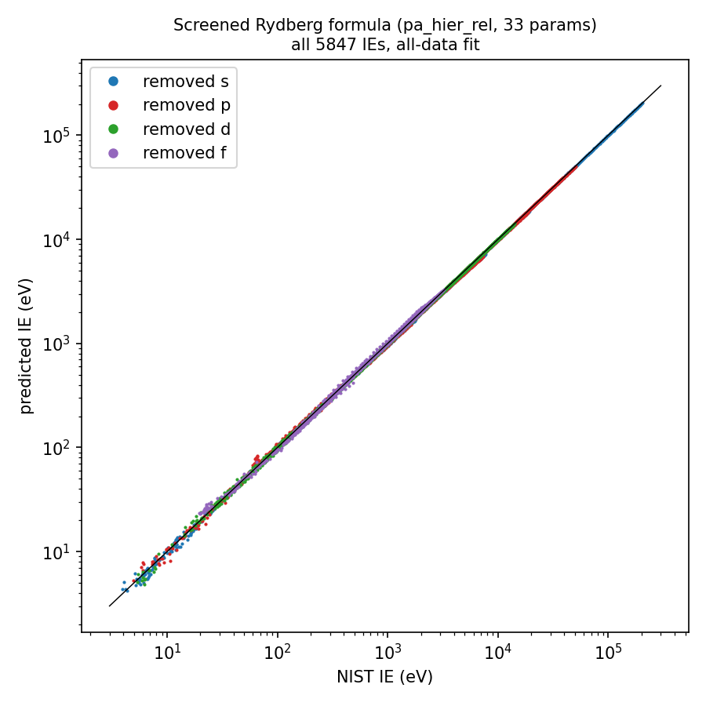
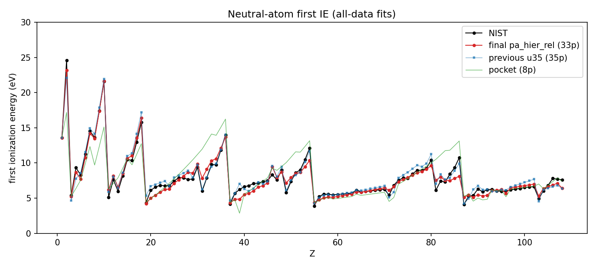
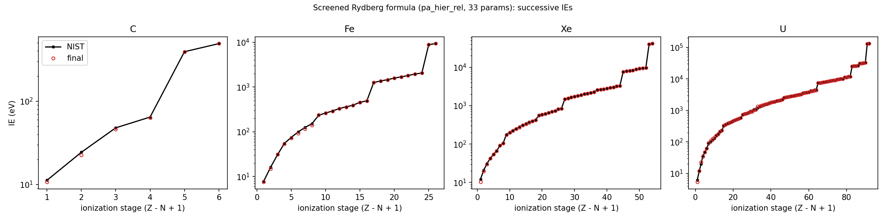
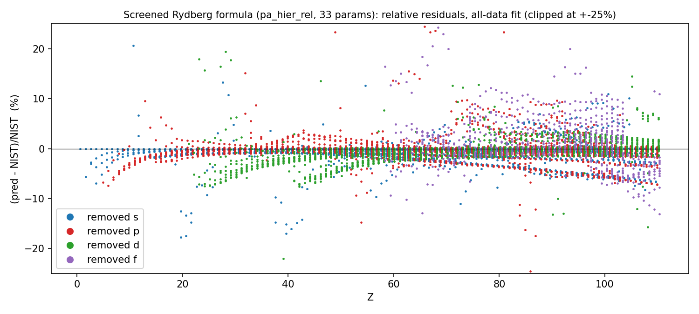

# The Screened Rydberg formula: final unified model for successive ionization energies IE(Z, N)

Final model: **`pa_hier_rel`** (33 fitted parameters). It combines exact first-order screening from Track A
(`docs/first_principles.md`) with a bounded, fitted higher-order remainder built from Track B's screening classes
(`docs/semi_empirical.md`) and the Push A saturation form (`models/push_a/NOTES.md`).

- Code: `models/unified/final.py` (dispatcher, default `pa_hier_rel`). The formula itself is in
  `models/push_a/model.py`, imported read-only via `models/unified/push_a_import.py`.
- Top-level API: `ionization.py`.
- Validation: `py -3.13 models/unified/validate_blind.py` (about 30 s), which writes `results/uni_validation.{json,md}`,
  `results/uni_predictions.csv` and `results/uni_final_params.json`.
- Comparison table and figures: `py -3.13 models/unified/report.py`, which writes
  `results/model_comparison.{csv,md}` and `results/figures/uni_*.png`.
- Coverage test: `py -3.13 tests/test_coverage.py`.

---

## 1. Headline: pre-registered validation

Every model below is refit on each training set with its own fit function.
- **Selection score** = mean MAPE over V1, V2, S1 and S3. It is the only quantity used to choose the final model.
- **S2** (fit Z ≤ 54, test Z ≥ 55) is the **blind** extrapolation test. It was computed once per candidate, after all
  choices were frozen, and never used for any choice.
- **Caveat:** S1 and S3, as pre-registered, contain Z ≥ 55 rows in both train and test (about 76 % of their test
  rows), so heavy-atom interpolation accuracy did inform the selection score. With S1/S3 restricted to Z ≤ 54 the
  winner is unchanged (§3, `results/uni_sensitivity_z54.json`).

All values are MAPE in %. Source: `results/uni_validation.md`, `results/pa_validation.json`,
`results/pb_validation.json`.

| model | fitted params | V1 (fit Z≤36 → 37–54) | V2 (fit Z≤44 → 45–54) | S1 (Z%5=0) | S3 (N%6=0) | selection score | **blind S2 (Z≥55)** | S2 median | S2 neutral 1st IE | all-data | all-data neutral | H-like |
|---|---|---|---|---|---|---|---|---|---|---|---|---|
| **FINAL `pa_hier_rel`** | **33** | 3.09 | 1.60 | 1.91 | 2.00 | **2.15** | **6.60** | 1.62 | 21.8 | 1.87 | 7.52 | 0.0012 |
| Push B choice `pb_clip_pos` | 30 | 4.04 | 1.84 | 1.76 | 1.85 | 2.37 | 13.9 | 1.56 | 248 | 1.75 | 7.49 | 0.0012 |
| previous unified final `u35` | 35 | 26.4 | 1.48 | 1.52 | 1.65 | 7.76 | 57.2 | 2.00 | 3831 | **1.48** | **6.43** | 0.0012 |
| Track B GSHM final, **blind** | 32 | 34.1 | 1.65 | 1.59 | 1.70 | 9.77 | **170** | 3.51 | 7393 | 1.57 | 7.61 | 0.19 |
| Track B GSHM core, **blind** | 30 | 33.7 | 1.31 | 1.63 | 1.71 | 9.60 | **178.5** | 1.41 | 7953 | 1.62 | 7.71 | 0.19 |
| Track B GSHM final with post-hoc σ_core ∈ [0.8, 1] (**not blind**) | 32 | – | – | 1.59 | 1.70 | – | 18.7 (earlier "19 %") | 3.60 | 235 | 1.57 | 7.61 | 0.19 |
| pocket formula | 8 | 4.4·10⁶ (fit diverges) | 2.55 | 4.62 | 5.24 | (1.1·10⁶) | 11.3 | 2.04 | 12.3 | 4.68 | 16.8 | 1.16 |
| Slater's rules, total-energy difference | 0 | 13.4 | 14.4 | 11.6 | 12.4 | 12.9 | 11.6 | 8.07 | 50.7 | 11.8 | 51.8 | 6.00 |
| Track A zexp (exact O(Z², Z), heuristic O(1)) | 0 | 53.4 | 54.0 | 68.3 | 74.3 | 62.5 | 77.8 | – | 1772 | 69.8 | 1105 | 0.0012 |

The final model's numbers were reproduced independently by `validate_blind.py`. They match Push A's own run to the
last digit, with differences of 0.0 in every split. The u35 and pocket references also match Push A and Push B
exactly. GSHM's blind S2 matches the earlier unified run (170.27) to 4·10⁻⁴.

**Did derived screening fix heavy-element extrapolation?** Mostly, but not completely, and not by itself.

- **Exact σ₁ alone was not enough.** Exact σ₁ with a linear fitted remainder (u35) cut blind S2 from 170–178 %
  (Track B) to 57 %. Heavy near-neutral atoms still blew up (S2 neutral MAPE 3831 %).
- **σ₁ plus the bound brought S2 to 6.6 %.** The decisive addition was the Push A bound
  Z_a ≤ Z_eff ≤ Z: a smooth saturation of the fitted remainder, with σ₁ kept as the exact large-Z anchor. Blind S2
  went from 57 % to **6.6 %**, under the ~10 % target, with a median of 1.6 %. That beats both the post-hoc 19 % and
  Slater's 11.6 %.
- **The bound was chosen on the selection score, not on S2.** It is worth about one point of selection score:
  2.91 with it against 3.96 without, in the 14-parameter ablation.
- **Heavy neutral atoms are still the weak spot.** Their blind S2 first-IE MAPE is 21.8 %. Lr is even predicted
  negative in the Z ≤ 54 fit (§7). So the fix holds for ions, where the S2 MAPE on Z > N rows is 6.4 %, and only
  partly for near-neutral heavy atoms.
- **The bound costs some in-distribution accuracy:** all-data MAPE is 1.87 % against u35's 1.48 %, and the neutral
  first IE is 7.5 % against 6.4 %.






---

## 2. The final equation

### 2.1 Formula

$$
\mathrm{IE}(Z,N)=\mu(Z)\Big\{\mathrm{Ry}\,\frac{Z_\mathrm{eff}^2}{n^2}\,D_{n,j}(Z_\mathrm{eff})\Big[1+r_c\,\frac{(Z\alpha)^2}{n}\Big(\frac{Z_\mathrm{eff}}{Z_a}-1\Big)\Big]+\mathrm{Ry}\,\frac{x_l\,K_l(k)}{n^2}\Big\}-\big[\Delta E_\mathrm{QED}+\Delta E_\mathrm{FNS}\big]_{Z,n}\Big(\frac{Z_\mathrm{eff}}{Z}\Big)^2
$$

The last term applies only when an ns electron with n ≤ 2 is removed.

$$
Z_\mathrm{eff}=Z-\sigma_1(\mathcal C)-D,\qquad
D=\frac{T}{Z_a+\kappa+|T|/h},\qquad
h=\begin{cases}(N-1)-\sigma_1 & T\ge 0\\ \sigma_1 & T<0\end{cases},\qquad
T=\sum_{g}\tau_g\,\nu_g+\sum_{c}\delta\tau_c\,\nu_c
$$

Equivalently, D = sign(T)·h·u/(1+u) with u = |T|/[h(Z_a+κ)]. Two consequences follow.

- **The bound holds for any parameter values:** Z_a ≤ Z_eff ≤ Z. Z_eff ≥ Z_a is the non-penetrating hydrogenic
  limit. Z_eff ≤ Z means there is no net anti-screening. The guarantee also needs 0 ≤ σ₁ ≤ N − 1 for the input
  configuration (the code clamps h ≥ 10⁻⁹). This is a checked property, not a proven one: it holds for all 7021
  ground/Madelung configurations with Z ≤ 118 (0 violations), but a user-supplied `shells=` configuration is not
  checked automatically.
- **The fitted part vanishes at large Z.** As Z_a → ∞ at fixed N, D → T/(Z_a+κ) = O(1/Z). So
  IE = Ry[Z² − 2Zσ₁ + O(1)]/n², and the Z² and Z coefficients of the 1/Z expansion are exact. The fitted part only
  models ΔE₂ and higher orders: relaxation, correlation and penetration at low charge.

### 2.2 Symbols

- Z is the nuclear charge and N the number of electrons before ionization. Z_a = Z − N + 1 is the asymptotic charge
  seen by the outgoing electron.
- Ry = 13.6057 eV is the Rydberg energy. α is the fine-structure constant.
- (n, l) is the removed subshell and k its occupancy.
- j is the jj-coupling value of the removed electron: l − ½ while k ≤ 2l, otherwise l + ½.
- c ∈ {s, p½, p3/2, d, f} is its relativistic class.
- **σ₁(𝒞) = −n² ΔE₁** is the exact first-order screening constant. ΔE₁ is the first-order (1/Z) energy change on
  removing the electron, a rational number from hydrogenic F^k/G^k Slater integrals, Hund angular algebra and
  Layzer-complex diagonalization (`models/unified/abinitio.py` → Track A `zexp.coeffs`). Examples: He 5/8;
  Li 1.5912, from E₁(1s²2s) = 5965/5832; O 5.2335; Ne-like 2p 6.5460; Na 7.786; Cs 42.83. It has 0 parameters.
- **ν_g** counts the other electrons in each pocket screening group:
  - *same*: the same subshell.
  - *in*: for an s or p target, the same-n s electrons (for a p target) plus the whole (n−1) shell.
  - *core*: for an s or p target, electrons with n′ ≤ n−2.
  - *df*: for a d or f target, all other electrons with n′ ≤ n.
  - *out*: electrons with n′ > n.
- **ν_c** counts electrons in the Track B screening classes (`gshm.classify`), with the `core` class split by target
  type into core_sp and core_df.
- **δτ_c** are class deviations, ridge-shrunk toward their group value with penalty 10⁻⁴ · N_rows · δτ². A class with
  no electrons in the training rows gets no parameter and inherits its group value.
- **D_{n,j}(Z_eff)** is the exact point-nucleus Dirac/Schrödinger energy ratio for charge Z_eff. It has no
  parameters.
- **r_c** is the relativistic penetration coefficient, a Fermi–Segrè-type bracket. r_f is tied to r_d when the
  training set has no f removals.
- **K_l(k) = [P(k) − P(k−1)] − 2l(k−1)/(4l+1)** is the Hund exchange kink, where P counts parallel-spin pairs. For p
  electrons it is 0, 0.6, 1.2, −1.2, −0.6, 0. **x_l** is its fitted amplitude.
- **μ(Z) = M/(M+mₑ)** is the reduced-mass factor.
- **ΔE_QED** is the one-loop self-energy (Yerokhin–Shabaev 2015 table) plus the Uehling term. **ΔE_FNS** is the
  finite-nuclear-size shift. Both are Track A and parameter-free, and both are extrapolated beyond Z = 110.
- κ in the code is |κ| + 0.05.

### 2.3 Parameter table (all-data fit, `results/uni_final_params.json`, identical to `results/pa_params.json`)

| block | n | values |
|---|---|---|
| group screening τ_g | 5 | τ_same 0.3928, τ_in 0.7879, τ_core 2.2243, τ_df 2.5488, τ_out 10.5688 |
| denominator κ | 1 | 1.7527 (1.8027 as used) |
| class deviations δτ_c (ridge 10⁻⁴) | 19 | same_s −0.1552, same_p 0.0098, same_d 0.0004, same_f 0.1457, sn_in_p −0.1133, n1_sp_sp −0.3916, n1_sp_d 0.3009, n1_sp_f 0.2042, n2_sp_sp −0.2195, n2_sp_df −0.0622, d_near −0.6962, n1_d_d −0.2689, n1_d_f 0.3286, f_near 0.5476, n1_f_f −0.0918, out_d −0.0176, out_f 0.0173, core_sp 0.2828, core_df 0.1812 |
| relativistic penetration r_c | 5 | s −0.4543, p½ −0.8129, p3/2 −1.1533, d −0.8426, f −1.4672 |
| Hund amplitude x_l | 3 | p 0.2049, d 0.4402, f 0.4612 |
| **total** | **33** | All 19 ridge-shrunk deviations are counted as full parameters; their effective degrees of freedom are fewer. |

There are no per-element or per-ion parameters. `predict()` reads only configurations, from the NIST ground
configuration table, or the Madelung order outside it. It never reads NIST ionization energies.

### 2.4 Derivation lineage

| term | origin | status |
|---|---|---|
| Ry Z²/n² | Bohr; ΔE₀ = 1/(2n²) of Track A's 1/Z expansion | exact (non-relativistic) |
| −σ₁ in Z_eff (gives −2Zσ₁ Ry/n²) | **Track A**, exact first-order perturbation theory (`zexp`, `config_energy`, `abinitio.py`) | exact, 0 parameters |
| T/(Z_a + κ) form of the remainder | **Track B** discovery: Z_eff − Z_a along each isoelectronic sequence follows p∞ − τ/(Z_a + κ). This is an Edlén-type law (§5) | fitted |
| screening groups ν_g (same/in/core/df/out) | unified **pocket formula** (`pocket.py`), built from Track B classes | fitted τ_g |
| class deviations δτ_c and their classes | **Track B** classes; hierarchical ridge shrinkage from **Push A** | fitted, shrunk |
| saturation D = T/(Z_a + κ + \|T\|/h) giving Z_a ≤ Z_eff ≤ Z | **Push A** (an a-priori physical bound; adopted on the selection score) | form fixed, 0 extra parameters |
| D_{n,j}(Z_eff) | exact Dirac point-nucleus ratio (Track B implementation of Track A physics) | parameter-free |
| r_c bracket (Z α)²(Z_eff/Z_a − 1)/n | **Track B** relativistic-penetration form (Fermi–Segrè type) | fitted |
| x_l K_l(k) | **Track B** Hund kink, O(Z⁰) as in u35 so the exact O(Z) term is kept | fitted amplitude, exact combinatorics |
| μ(Z), ΔE_QED, ΔE_FNS | **Track A** (`relativity.py`, YS15 table, numerical FNS) | parameter-free, external theory inputs |

Removed relative to u35: the second-order τ⁽²⁾/(Z_a+κ)² terms, κ_l, and the exp(b(Zα)²) sparse corrections.

---

## 3. Selection-protocol history

1. **Track B** reported S2 = 19 %. That figure depended on a σ_core ∈ [0.8, 1] bound added *after* seeing S2. The
   blind value is 178.5 % for core and 170 % for final. The referee flagged this.
2. **First unified stage.** The final model was chosen by the lowest mean held-out MAPE over S1, S2 and S3. The first
   pass used GSHM's post-hoc-bounded S2 and picked `uni_gshm_qed`. The interrupted final-fix pass re-ran it with
   blind S2 numbers and picked **u35** (scores u35 20.1, u29 47.3, gshm_qed 57.8). **Both passes used S2 as a
   selection criterion.** That is a mild leak: S2 was no longer a blind test for the chosen model.
3. **Now (pre-registered).** Two independent push agents (A and B) designed candidates using **only** V1, V2, S1 and
   S3, plus Z ≤ 54 data for anything extrapolation-related. The orchestrator's script picked the winner by the lowest
   selection score among all candidates. Each candidate's S2 was computed once, after freezing, for reporting.
   **S2 (fit Z ≤ 54 → Z ≥ 55) was never used for any choice.** However, the S1/S3 selection splits, as
   pre-registered, contain Z ≥ 55 rows in both train and test (913 of 1188 S1 test rows and 703 of 928 S3 test rows,
   about 76 %; 3449 and 3659 Z ≥ 55 training rows). So heavy-atom *interpolation* accuracy did inform the design
   choices (ridge, relativistic form, saturation shape, hierarchical classes); only the blind *extrapolation* test S2
   was kept out. (An earlier version of this section wrongly said that no Z ≥ 55 row influenced any choice.)
   Robustness check, added after the audit (reporting only, no choice changed; `models/unified/sensitivity_z54.py`,
   `results/uni_sensitivity_z54.json`): recomputing the selection score with S1 and S3 restricted to Z ≤ 54 (train
   and test) leaves the winner unchanged: pa_hier_rel 1.844 < pa_hier 1.989 < pa_bound9 2.094 < pb_clip_pos 2.118 <
   pa_bound14_relfit 2.697 < pb_exp_pos 3.596. This checks the ranking of the frozen candidates only, not the
   exploration path that produced them. The ranking was:
   - pa_hier_rel 2.148
   - pb_clip_pos 2.370
   - pa_hier 2.374
   - pa_bound9 2.514
   - pa_bound14_relfit 2.905
   - …
   - ref_u35 7.76

   The complete table is in `results/model_comparison.md`.

**Disclosures carried over from the push agents.**
- **Both agents knew in advance where u35 failed.** The brief said u35 fails on heavy near-neutral atoms (Po, Hs,
  No, Ac, Tl, Ta, Sg, Hf, Md: 6p/6d/7s/5d removal), and that motivated the bounded-Z_eff direction. The bound itself
  was adopted on the selection-score ablation (2.91 vs 3.96).
- **Push A's starting point was informed by a known S2 result.** Push A knew the pocket formula extrapolated well
  (11.3 % S2), so it tried pocket groups first. They also won on the selection score (2.91 vs 6.57 for a 4-group
  form).
- **The exploration was small, and taking its minimum is optimistic.** Push A logged 43 scored variants
  (`models/push_a/explore_log.txt`) and Push B about 14, so about 57 in total (plus the candidates re-scored in the
  two `validate.py` scripts). The minimum selection score over these is somewhat optimistic.
- **Push B's constraints were data-informed.** Its t_c ≥ 0 constraint and extra analogue ties came from diagnosing
  the worst V1 rows (Rb–Xe neutrals). V1 is a selection split, so this is allowed, but those choices are not purely a
  priori.
- **One rejected candidate scored better on S2.** `pb_exp_pos` has blind S2 6.03 %, lower than the final model's
  6.60 %, but its selection score is worse (3.73). Promoting it would be selection on S2, so it was not done. Any
  later model that adopts its tighter upper bound Z_eff ≤ Z − σ₁ must disclose that S2 results for that form have been
  seen.
- **The pocket reference was reported as it is.** It diverges on V1 under its own `pocket.fit` settings (unbounded
  Z_eff), and was not repaired.
- **The u35 ridge was chosen earlier.** u35 is refit with its original ridge of 0.02, which an earlier session chose
  on the inner split Z ≤ 44 → 45–54.
- **The relativistic coefficients have the wrong sign.** The fitted r_c come out negative, so the relativistic
  bracket is not physically bounded (see §7).
- **Structural leakage remains.** The Track B screening classes and the Hund kink were designed earlier on all rows,
  including Z ≥ 55.

**Disclosures from this integration stage.**
- **No numbers were changed.** I refit and re-scored every model. Nothing was changed after seeing any number.
- **I looked at S2 only to describe it.** After the model was frozen, I listed the worst S2 rows to write §7. That
  happened after the choice and changed nothing.
- **The coverage test was run once, after freezing.**
- **Superheavy predictions are weak and were left as they are.** The final model's superheavy values (§7) were
  looked at only after freezing. Fixing them now would be post hoc.

---

## 4. Referee responses (`handoff/referee_report.json`)

| # | referee issue | response | status |
|---|---|---|---|
| 1 (major) | Track A `predict()` crashed for Z > 110 when an s electron is removed | `relativity.py` now extrapolates F_SE/F_U past the Z = 110 table and uses an A ≈ 2.5Z radius formula. `ionization_energy(120, 2)` = 254 719 eV. `tests/test_coverage.py` runs every Z = 1..118 and N = 1..Z through the public API: 7021/7021 values are finite and > 0, with no crashes. `models/first_principles/test_superheavy.py` covers (120,2), (119,1) and (118,2). | fixed |
| 2 (major) | Track B's S2 headline used a post-hoc bound; the blind value is 178.5 % | Every table now shows the blind S2 (GSHM final 170 %, core 178.5 %) next to the post-hoc 18.7 % / 19.2 %, labelled "not blind". As the referee suggested, the deep-core screening is now anchored on Track A's exact σ₁, not on a bound tuned on the test set. The final model was chosen by a pre-registered rule that excludes S2, and its blind S2 is 6.60 %. | fixed |
| 3 (minor) | Track B's sparse (Zα)² corrections hurt extrapolation; core extrapolates better | The final model contains none of the sparse exp(b(Zα)²) terms. GSHM core is reported as a reference: its blind S2 median is 1.41 % against 3.51 % for final. | addressed |
| 4 (minor) | Track B's structure was discovered on all rows (structural leakage) | Stated next to the headline (§3) and in the limitations. The final model inherits Track B's class definitions and Hund kink, so this leakage applies to it too. | disclosed |
| 5 (minor) | τ/(Z_a+κ) is an Edlén-type formula; the novelty is overstated | Reframed in §5 as an independent rediscovery of Edlén-type isoelectronic behaviour, not a new law. | addressed |
| 6 (minor) | Track A's "zero-parameter first-principles" formula contains heuristic choices | Labelled everywhere as "exact through O(Z) + heuristic O(1) completion; zero fitted parameters" (comparison table: "A: zexp headline (exact O(Z^2,Z) + heuristic O(1) + rel)"). Only ΔE₀, ΔE₁ and the H-like layers are called first-principles. The final model uses only the exact part, σ₁. | addressed |
| 7 (minor) | Three different "Bohr" baselines | Only `se_bohr` (Ry Z²/n²: 1363 % MAPE, neutral 22 878 %) is quoted. Track A's `fp_bohr` (1340 %, neutral 22 527 %) differs only in how rearranged rows are treated. | addressed |
| 8 (minor) | Out-of-table extrapolation is unvalidated for superheavy elements | Documented as qualitative only. In a sanity check against approximate relativistic coupled-cluster values, the final model is poor for 7p neutrals (§7). The CLI flags every Z > 110 row as "PREDICTION (not in NIST table)". | addressed (weakness documented) |
| notes | Use exact σ₁ for deep-core/f screening; Track A H-like layer; Z > 110 guard; DFT for neutrals | The first three are done: σ₁ is the anchor of every screening term, the H-like MAPE is 0.0012 % (reported as consistency with YS15, not independent validation), and Z > 110 is guarded. LSDA ΔSCF for all rows was not done (time box). It remains the best parameter-free neutral-atom method on its 207 rows (3.3 %). | partly done |

---

## 5. Framing

- **Track B's τ/(Z_a+κ) is not a new law.** It says that Z_eff − Z_a along an isoelectronic sequence approaches a
  constant as p∞ − τ/(Z_a+κ). That is an independent rediscovery of the isoelectronic behaviour that Edlén
  formalised: expansions in ζ = q + 1 with 1/(ζ + s) screening terms, together with Layzer's 1/Z theory. What is new
  is narrower:
  - one universal denominator works across all 110 sequences (κ ≈ 8 in GSHM, 1.75 here with saturation);
  - it is combined with exact rational σ₁ coefficients;
  - it is combined with a saturation bound that makes the remainder safe to extrapolate.
- **The thesis: derived first-order screening covers where data fitting cannot extrapolate, and vice versa.**
  - Fitting alone (GSHM) interpolates to 1.6 % but extrapolates to new shells catastrophically: V1 34 %, blind S2
    170 %.
  - Exact theory alone (Track A zexp) extrapolates smoothly but is about 70 % off overall and about 1100 % off for
    neutrals, because σ₁ under-screens valence electrons.
  - The combination fixes the exact Z² and Z terms by theory and confines the fit to a bounded O(Z⁰) remainder. It
    keeps about 2 % accuracy inside the data and reaches 6.6 % blind extrapolation.
- **The most original piece is Track A's table of exact σ₁.** These are rational first-order screening constants for
  every ground configuration, N = 1..110.

---

## 6. Worked hand examples

Both examples remove a 2p electron, so the QED/FNS term is zero and μ ≈ 0.99997.

### 6.1 First IE of oxygen (Z = N = 8, 1s²2s²2p⁴ → 1s²2s²2p³; NIST 13.618 eV)

The removed electron is 2p with k = 4, so j = 3/2 (class p3/2), Z_a = 1 and K_p(4) = −1.2.

**Final formula.**
1. **Exact screening.** σ₁ = −n²ΔE₁ = 4 × 1.308370 = **5.23348** (Track A table, `results/fp_zexp_coefficients.csv`;
   Slater's rules give 3.45).
2. **Counts.** ν_same = 3, ν_in = 2 (2s) + 2 (1s) = 4, and the other groups are 0. The classes are same_p 3,
   sn_in_p 2 and n1_sp_sp 2.
3. **Remainder.** T = 0.3928·3 + 0.7879·4 + [3·0.0098 + 2·(−0.1133) + 2·(−0.3916)] = 4.3300 − 0.9804 = **3.3496**.
4. **Saturation.** T ≥ 0, so h = N − 1 − σ₁ = 7 − 5.23348 = 1.76652. Then u = 3.3496 / [1.76652·(1 + 1.8027)] = 0.67654
   and D = h·u/(1+u) = **0.71285**.
5. **Effective charge.** Z_eff = 8 − 5.23348 − 0.71285 = **2.05367**, which lies between Z_a = 1 and Z = 8.
6. **Hydrogenic term.** Ry Z_eff²/4 = 13.6057 × 4.21756/4 = 14.3457 eV.
7. **Relativity.** The Dirac factor is D_{2,3/2} = 1.000014. The penetration bracket is
   1 − 1.1533 · (8/137.036)² · (2.05367 − 1)/2 = 0.997929. Together: 14.3162 eV.
8. **Hund kink.** Ry · 0.2049 · (−1.2)/4 = −0.8365 eV.
9. **Result.** IE = (14.3162 − 0.8365) × 0.999966 = **13.479 eV**, an error of **−1.02 %**.

**Pocket formula** (8 parameters, all-data fit: s_same 0.7499, s_in 0.7514, t 1.3725, κ 9.865 as used, x 0.508).
- Z_eff = 8 − 0.7499·3 − 0.7514·4 − 1.3725·7/(1 + 9.865) = 8 − 5.2553 − 0.8843 = **1.8605**.
- IE = 13.6057 · 1.8605²/4 · (1 + 1.2·10⁻⁵) + 13.6057 · 0.508 · (−1.2)/4 = 11.775 − 2.074 = **9.70 eV** (−28.8 %).
- Light 2p neutrals are the pocket formula's known weak spot: its single Hund amplitude is too large for 2p.

### 6.2 Third IE of magnesium (Mg²⁺, Z = 12, N = 10, 1s²2s²2p⁶ → 2p⁵; NIST 80.144 eV)

The removed electron is 2p with k = 6, so j = 3/2, Z_a = 3 and K_p(6) = 0.

**Final formula.**
1. **Exact screening.** σ₁ = **6.54598**. It is the same for every Ne-like ion, because σ₁ does not depend on Z.
2. **Counts.** ν_same = 5 and ν_in = 4. The classes are same_p 5, sn_in_p 2 and n1_sp_sp 2.
3. **Remainder.** T = 0.3928·5 + 0.7879·4 + [5·0.0098 − 2·0.1133 − 2·0.3916] = 5.1156 − 0.9607 = **4.1548**.
4. **Saturation.** h = 9 − 6.54598 = 2.45402. Then u = 4.1548/[2.45402·(3 + 1.8027)] = 0.35252 and
   D = 2.45402 · 0.35252/1.35252 = **0.63962**.
5. **Effective charge.** Z_eff = 12 − 6.54598 − 0.63962 = **4.81440**.
6. **Hydrogenic term.** Ry Z_eff²/4 = 13.6057 · 23.1784/4 = 78.840 eV.
7. **Relativity.** The Dirac factor is 1.000077. The bracket is 1 − 1.1533 · (12/137.036)² · (4.8144/3 − 1)/2 = 0.997326.
8. **Hund kink.** The term is 0, because K_p(6) = 0.
9. **Result.** IE = 78.840 × 1.000077 × 0.997326 × 0.999977 = **78.63 eV**, an error of **−1.88 %**.

**Pocket formula.**
- Z_eff = 12 − 0.7499·5 − 0.7514·4 − 1.3725·9/(3 + 9.865) = 12 − 6.7551 − 0.9602 = **4.2847**.
- IE = 13.6057 · 4.2847²/4 · 1.00006 = **62.46 eV** (−22.1 %).

These values agree with the code: `ionization_energy("O")` = 13.4793, `ionization_energy(12, 10)` = 78.6333, and
`--model pocket` gives 9.7013 and 62.4557.

---

## 7. Limitations

- **Heavy neutral atoms remain the weak spot.**
  - The blind S2 neutral first-IE MAPE is 21.8 %. Worst cases in the Z ≤ 54 fit: Pb 1.19 vs 7.42 eV, Tl 1.73 vs
    6.11, Lu 7.91 vs 5.43, Rn 6.10 vs 10.75.
  - **Lr comes out negative (−3.33 eV) in the Z ≤ 54 fit.** The fitted relativistic coefficients r_c are negative,
    and the bracket 1 + r_c(Zα)²(Z_eff/Z_a − 1)/n is not bounded. So the Z_a ≤ Z_eff bound does not guarantee a
    positive IE once Zα is large.
  - The all-data fit is positive everywhere (see the coverage item below), but this is a structural defect. A
    physically bounded relativistic term is the obvious next step, and it must be chosen on V1/V2/S1/S3 only.
- **f-electron removal is the least accurate.** All-data removed-f MAPE is 3.5 %. In S2 the third-stage lanthanide
  and actinide IEs (4f/5f removal, e.g. Er²⁺, Tb²⁺, Cm²⁺) come out about 2.0–2.5× too high (mean 2.2×, median 2.1×;
  23 rows; worst Er²⁺ 55.65 vs 22.7 eV), because a Z ≤ 54 training set has no f electrons.
- **Superheavy predictions are qualitative only.** First IEs from the final model, compared with approximate
  relativistic coupled-cluster values:

  | element | final model (eV) | approx. literature (eV) |
  |---|---|---|
  | Cn (112) | 9.10 | ≈ 12 |
  | Fl (114) | 6.39 | ≈ 8.5 |
  | Og (118) | 3.66 | ≈ 8.9 |
  | E120 | 5.58 | ≈ 5.8 |

  The 7p neutrals are too low; the cause is the same negative r_c. u35 gives Og 7.74 and the pocket formula 13.1. Above
  Z = 110 the configurations are Madelung, and QED/FNS are extrapolated.
- **Monotonicity.** Over Z = 1..118 (7021 values), the coverage test finds **22 violations** of IE(Z, N−1) > IE(Z, N).
  Six are at Pt–Bi (N ≈ 60–62, 4f/5s ordering, ratios 0.94–1.00). Sixteen are at Rf–Ds, where the NIST ground
  configuration jumps between adjacent ions: for example Rf N = 68 is 4f¹²6s², while N = 69 is 4f¹⁴5d¹. A
  single-configuration formula fed rearranged configurations cannot be monotone there.
- **There are more fitted parameters than strictly needed.**
  - 33 parameters, against u35's 35 and the pocket formula's 8. 19 of them are ridge-shrunk deviations.
  - The 9-parameter `pa_bound9` has selection score 2.51 (blind S2 7.80 %, all-data 2.90 %). That is a reasonable
    lighter alternative, though not the pre-registered winner.
- **In-distribution cost.** All-data MAPE is 1.87 %, against 1.48 % for u35 and 1.57 % for GSHM.
- **Structural leakage.** Track B's classes and the Hund kink were designed on all rows. The S1/S3 selection splits contain Z ≥ 55
  rows (§3). The selection minimum over about 57 explored variants (43 Push A + ~14 Push B) is optimistic.
- **The configuration is an input.** It comes from the NIST ground-configuration table, or Madelung outside it.
  There is no multiplet structure beyond one Hund kink.
- **The QED/FNS layer covers only 1s and 2s.** It is scaled by (Z_eff/Z)². The H-like 0.0012 % shows consistency
  with the same YS15 theory that NIST used, not independent validation.
- **Track A's LSDA ΔSCF is still better for neutral atoms** (3.3 %, no parameters) on its 207 rows (Z ≤ 54). It is
  not a closed form and was not extended.

---

## 8. API

```python
from ionization import ionization_energy, successive_ionization_energies
ionization_energy("O")             # 13.479 eV (first IE, final model)
ionization_energy(26, N=1)         # Fe25+ (H-like) 9277.687 eV (NIST 9277.689)
ionization_energy(12, 10)          # Mg2+ -> Mg3+, 78.633 eV
successive_ionization_energies("C", model="u35")
```

CLI:
- `py -3.13 ionization.py Fe` prints all 26 IEs against NIST.
- `py -3.13 ionization.py 26 --N 26` prints a single value.
- `py -3.13 ionization.py 118` extrapolates and flags every row as a prediction.
- `--model pa_hier_rel|uni_u35|uni_u29|uni_pocket|uni_gshm_qed` selects a model. The aliases final, u35, u29, pocket
  and gshm_qed also work.

The legacy stage-1 script `run_unified.py` still rebuilds u29, u35, gshm_qed and pocket. It no longer overwrites
`uni_predictions.csv` or `uni_validation.json`.

---

## 9. Audit responses (final audit, 2026-10-05)

An independent audit re-implemented the protocol from `data/nist_ie.csv` and reproduced every headline number
(selection 2.148; blind S2 6.603, median 1.616, neutral 21.759; all-data 1.874 / 0.940 / 7.515 / 0.00116; 33
parameters; no S2 leakage when the Z ≥ 55 targets are scrambled; coverage test PASS). It found no critical issues,
one major and six minor ones. All were fixed; none of the fixes changes the model, a parameter or a number.

| severity | finding | response |
|---|---|---|
| major | Several documents said that no Z ≥ 55 row influenced any choice. In fact S1/S3 (half the selection score) contain Z ≥ 55 rows in train and test: 913/1188 S1 and 703/928 S3 test rows. | **Fixed (wording).** §1, §3, §7 here, the paper abstract, §3.2 and the Figure 2 caption, `models/push_b/NOTES.md`, `CONTINUE.md`, `results/model_comparison.md` and `results/uni_validation.md` now say: S2 was never used for any choice; S1/S3 contain heavy rows, so heavy-atom interpolation accuracy did inform the choices. Robustness check added (reporting only): with S1/S3 restricted to Z ≤ 54 the winner is unchanged, pa_hier_rel 1.844 < pa_hier 1.989 < pa_bound9 2.094 < pb_clip_pos 2.118 (`models/unified/sensitivity_z54.py`, `results/uni_sensitivity_z54.json`; matches the audit's own values). This checks the frozen ranking, not the exploration path. |
| minor | `CONTINUE.md` still described the superseded S1+S2+S3 rule as "pre-registered". | **Fixed.** It now gives the V1/V2/S1/S3 rule and marks the old rule as superseded and S2-contaminated. |
| minor | The size of the exploration was reported inconsistently (30 / 44). | **Fixed.** Push A logged 43 variants (`explore_log.txt`), Push B about 14: about 57 in total, used in §3, §7 and the paper. |
| minor | "About 2.4×" overstated the S2 error for third-stage f removal. | **Fixed.** Re-checked: 23 rows, ratio mean 2.19, median 2.12, range 1.99–2.45 (worst Er²⁺ 55.65 vs 22.7 eV). Now "about 2.0–2.5× (mean 2.2×)" here and in the paper. |
| minor | `docs/literature.md` still called the model provisional and said the SHM was "reproduced", although our Kregar/Di Rocco implementation is not faithful for valence shells. | **Fixed.** The provisional sentence is gone; the wording is now "our implementation (from the published definitions)"; the 224 % neutral figure carries a caveat (Ar I 18.96 vs printed 14.72 eV; printed valence IEs 3–5 eV lower than ours) in the literature doc and in the paper. |
| minor | DFT rows in `model_comparison.md` showed "selection scores" (LSDA 2.27, transition state 2.07) computed on 207 rows only, not comparable with the fitted models' 2.15. | **Fixed.** `report.py` now shows n/a for them, with a footnote (207 rows, V1/V2 only 17/10 neutral rows, nothing fitted). |
| minor | The bound Z_a ≤ Z_eff ≤ Z also needs 0 ≤ σ₁ ≤ N − 1, a checked rather than proven property. | **Fixed.** Stated in §2.1 and in the paper (§2.2); `final.predict_many` now issues a RuntimeWarning if a configuration violates it (none of the 7021 Z ≤ 118 configurations does). Predictions are unchanged. |

After the fixes, `validate_blind.py` reproduced `results/uni_validation.json` exactly (all numeric fields identical)
and `results/uni_predictions.csv` byte for byte.

---

## Literature positioning and novelty

See docs/literature.md
